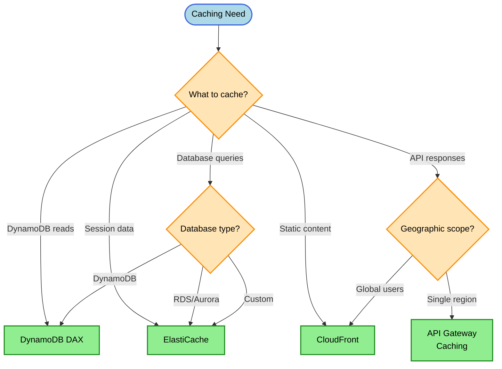
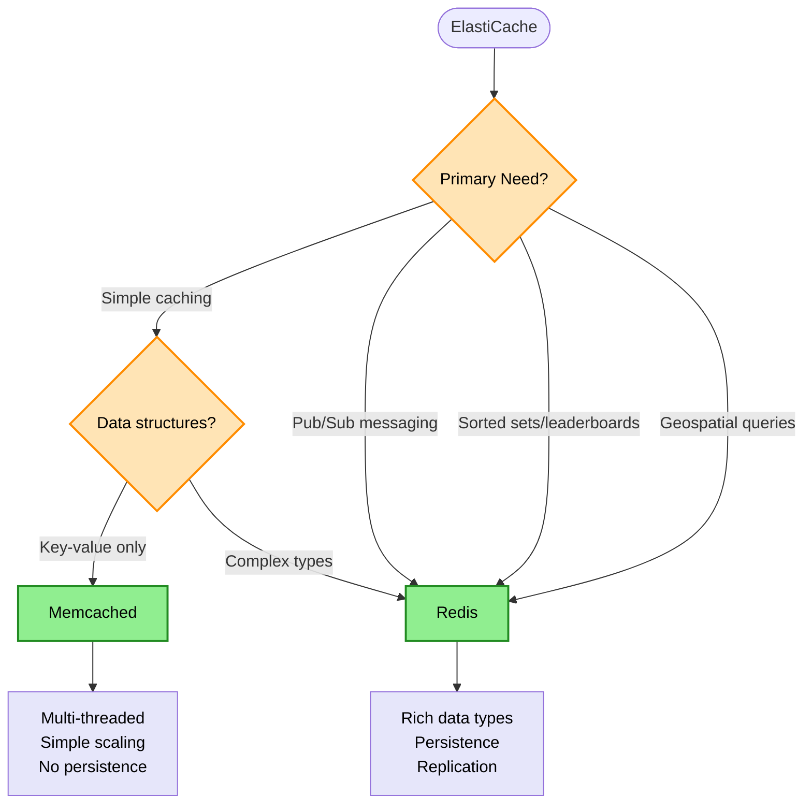
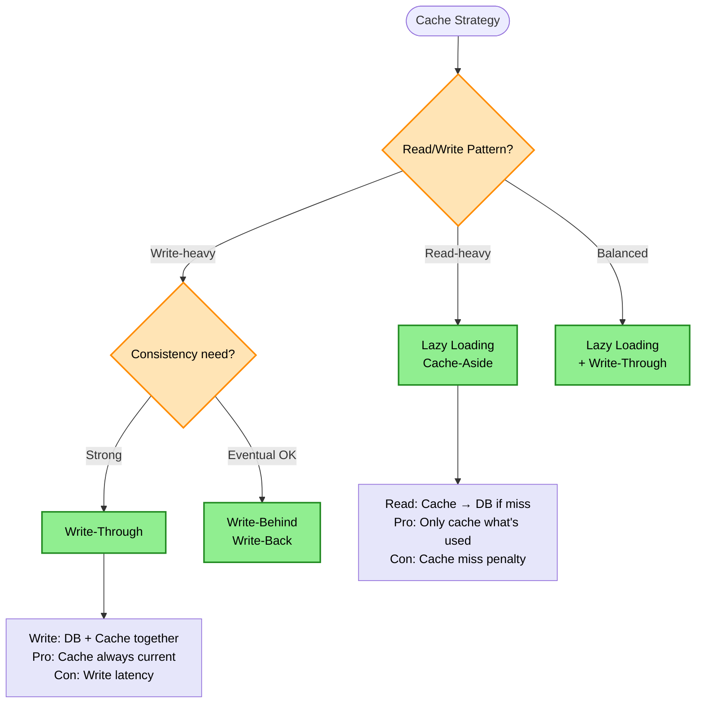

# Caching Decision Tree

> **Purpose:** Choose the right AWS caching solution based on data source, access patterns, latency requirements, and operational needs.

## Caching Layer Decision



## ElastiCache Engine Decision



## Caching Strategy Decision



## Keyword → Service Mapping

| Keywords / Signals | AWS Service | Reasoning |
|--------------------|-------------|-----------|
| DynamoDB read caching | DAX | Microsecond latency, transparent |
| session storage | ElastiCache Redis | Persistence, TTL support |
| leaderboards, sorted data | ElastiCache Redis | Sorted sets data structure |
| simple key-value cache | ElastiCache Memcached | Multi-threaded, simple |
| static content, global | CloudFront | Edge caching |
| API response caching | API Gateway Cache | Request-level caching |
| database query results | ElastiCache | Query result caching |
| microsecond DynamoDB | DAX | Purpose-built for DynamoDB |

## Elimination Rules

| Never Choose | When | Because |
|--------------|------|---------|
| DAX | Caching RDS/Aurora | DAX only works with DynamoDB |
| Memcached | Need persistence | Memcached has no persistence |
| Memcached | Need pub/sub | Redis has pub/sub |
| CloudFront | Dynamic, personalized content | CloudFront caches by URL |
| API Gateway cache | High volume, complex keys | Limited cache key options |

## DAX vs ElastiCache

| Aspect | DAX | ElastiCache |
|--------|-----|-------------|
| Purpose | DynamoDB caching | General caching |
| Latency | Microseconds | Sub-milliseconds |
| Integration | Transparent (SDK) | Application code change |
| Data Source | DynamoDB only | Any |
| Use Case | Read-heavy DynamoDB | DB queries, sessions |

## Redis vs Memcached

| Feature | Redis | Memcached |
|---------|-------|-----------|
| Data Structures | Strings, hashes, lists, sets, sorted sets | Strings only |
| Persistence | Yes (RDB, AOF) | No |
| Replication | Yes | No |
| Pub/Sub | Yes | No |
| Transactions | Yes | No |
| Lua Scripting | Yes | No |
| Multi-threaded | No (single-threaded) | Yes |
| Geospatial | Yes (GEOADD, GEORADIUS) | No |
| Use Case | Complex caching, sessions | Simple key-value |

> **Rule:** "Geospatial data" → Redis (only option)

## Session Management Options

| Solution | Latency | Persistence | Best For |
|----------|---------|-------------|----------|
| ElastiCache Redis | Sub-ms | Yes | Distributed sessions, HA |
| DynamoDB | ~ms | Yes | Simple sessions, serverless |
| Sticky Sessions | N/A | Instance-local | Single server, not recommended |

> **Rule:** "In-memory" + "distributed" + "session" → ElastiCache Redis. Sticky sessions don't protect against server failure.

## ElastiCache Redis HA/DR

| Configuration | Benefit |
|---------------|---------|
| Multi-AZ with Auto-Failover | Minimal downtime, minimal data loss |
| Read Replicas | Read scaling, manual promotion |
| Backups (AOF/RDB) | Point-in-time recovery |

> **Rule:** "Minimal downtime" + "minimal data loss" for Redis → Multi-AZ with Auto-Failover

## Cost Comparison

| Service | Pricing Model | Notes |
|---------|---------------|-------|
| DAX | Per node hour | r-type instances |
| ElastiCache Redis | Per node hour | Cluster mode optional |
| ElastiCache Memcached | Per node hour | Multi-threaded nodes |
| CloudFront | Data transfer + requests | Edge caching |
| API Gateway Cache | Per hour by size | 0.5GB to 237GB |

## Trade-off Matrix

| Aspect | DAX | Redis | Memcached | CloudFront |
|--------|-----|-------|-----------|------------|
| Latency | μs | sub-ms | sub-ms | Varies (edge) |
| Complexity | Low | Medium | Low | Low |
| Persistence | N/A | Yes | No | N/A |
| Data Types | DynamoDB | Rich | Key-value | HTTP |
| Ops | Low | Medium | Low | Low |

## Real-World Scenarios

### Scenario 1: DynamoDB Product Catalog
**Requirement:** Cache product reads, 90% read traffic
**Decision:** DAX
**Reasoning:** Transparent caching, microsecond latency

### Scenario 2: Gaming Leaderboard
**Requirement:** Top 100 players, real-time updates
**Decision:** ElastiCache Redis
**Reasoning:** Sorted sets perfect for leaderboards

### Scenario 3: Session Management
**Requirement:** Store user sessions, auto-expire
**Decision:** ElastiCache Redis
**Reasoning:** TTL support, persistence for HA

### Scenario 4: Simple Database Query Cache
**Requirement:** Cache SQL query results, no complex data
**Decision:** ElastiCache Memcached
**Reasoning:** Simple, multi-threaded, cost-effective

### Scenario 5: Global Static Assets
**Requirement:** Serve images/CSS/JS worldwide
**Decision:** S3 + CloudFront
**Reasoning:** Edge caching, low latency globally

### Scenario 6: REST API Acceleration
**Requirement:** Cache GET responses for 5 minutes
**Decision:** API Gateway caching + CloudFront
**Reasoning:** Request-level caching at edge

## Caching Strategies Explained

### Lazy Loading (Cache-Aside)

```
Read:
1. Check cache
2. If miss → Read from DB → Write to cache
3. Return data

Pros: Only caches accessed data
Cons: Cache miss penalty, stale data possible
```

### Write-Through

```
Write:
1. Write to DB
2. Write to cache
3. Return success

Pros: Cache always current
Cons: Write latency, caches unused data
```

### Write-Behind (Write-Back)

```
Write:
1. Write to cache
2. Return success immediately
3. Async write to DB

Pros: Fastest writes
Cons: Data loss risk if cache fails
```

### TTL (Time-To-Live)

```
Set expiration on cache entries:
- Too short: More cache misses
- Too long: More stale data
- Balance based on data volatility
```

## Common Mistakes

1. **Mistake:** Using DAX for non-DynamoDB databases
   **Correct approach:** Use ElastiCache for RDS/Aurora

2. **Mistake:** Choosing Memcached for complex data
   **Correct approach:** Use Redis for rich data structures

3. **Mistake:** Caching highly personalized content on CloudFront
   **Correct approach:** Use DAX/ElastiCache for user-specific data

4. **Mistake:** No cache invalidation strategy
   **Correct approach:** Implement TTL or event-driven invalidation

5. **Mistake:** Over-caching (everything)
   **Correct approach:** Cache hot data, not cold

## Cache Invalidation Strategies

| Strategy | Implementation | Use Case |
|----------|----------------|----------|
| TTL | Set expiration | Most common |
| Event-driven | Lambda on DB change | Strong consistency |
| Manual | API to clear cache | Admin override |
| Version keys | key:v1, key:v2 | Zero-downtime deploys |

## Related Decisions

- [Database Decisions](./database-decisions.md) - DynamoDB + DAX
- [Networking Decisions](./networking-decisions.md) - CloudFront
- [Compute Decisions](./compute-decisions.md) - Lambda + caching

---

## Quick Reference

1. **DynamoDB caching** → DAX (microseconds)
2. **Leaderboards** → Redis sorted sets
3. **Simple key-value** → Memcached
4. **Sessions with persistence** → Redis
5. **Global static content** → CloudFront
6. **API response cache** → API Gateway cache or CloudFront
7. **Pub/Sub needed** → Redis (not Memcached)
8. **Cache strategy** → Lazy loading for read-heavy
