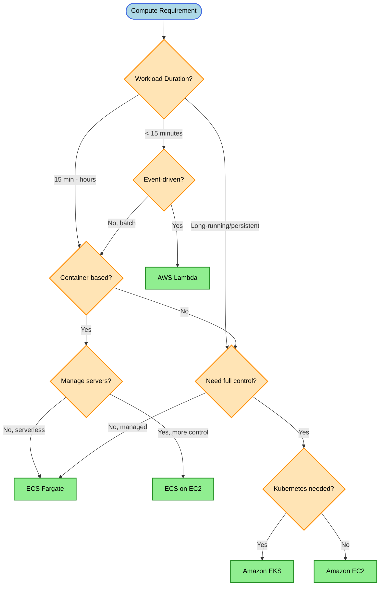
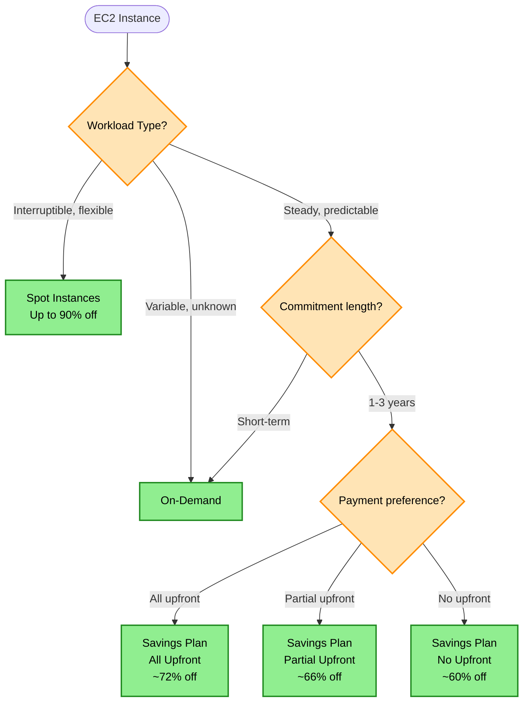
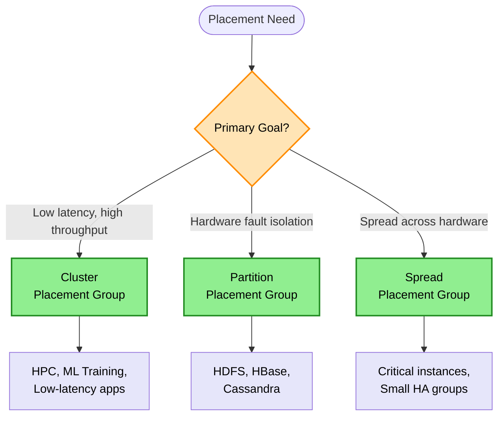

# Compute Decision Tree

> **Purpose:** Choose the right AWS compute service based on workload duration, scaling needs, cost constraints, and operational requirements.

## Decision Flowchart

## EC2 Pricing Decision

## Placement Group Decision

## Keyword → Service Mapping

| Keywords / Signals | AWS Service | Reasoning |
|--------------------|-------------|-----------|
| event-driven, < 15 min, serverless | Lambda | Auto-scaling, pay per invocation |
| containers, no server management | ECS Fargate | Serverless containers |
| containers, need EC2 control | ECS on EC2 | More control over instances |
| Kubernetes, portability | EKS | Managed Kubernetes |
| full control, persistent | EC2 | Maximum flexibility |
| interruptible, cost-sensitive | Spot Instances | Up to 90% discount |
| steady workload, 1-3 years | Savings Plans | Significant discount |
| HPC, low latency | Cluster placement | Single AZ, high bandwidth |
| fast resume with RAM state | EC2 Hibernate | Seconds to resume |
| pre-configured instances | Custom AMI | Minutes to launch |
| BYOL licensing | Dedicated Hosts | Maintain license compliance |
| simple web + GitHub | App Runner | Minimal ops overhead |

## Elimination Rules

| Never Choose | When | Because |
|--------------|------|---------|
| Lambda | Runtime > 15 minutes | Hard limit |
| Lambda | > 10 GB memory needed | Hard limit |
| EC2 + cron | Serverless option exists | More ops overhead |
| Spot | Cannot tolerate interruption | Can be terminated with 2 min notice |
| On-Demand | Predictable, long-term workload | Paying premium unnecessarily |
| Cluster placement | Need fault tolerance | All instances in single rack |

## Cost Comparison

| Service | Pricing Model | Cost Efficiency |
|---------|---------------|-----------------|
| Lambda | Per invocation + duration | Best for sporadic |
| Fargate | Per vCPU + memory per second | Good for containers |
| EC2 On-Demand | Per hour | Most expensive |
| EC2 Spot | Per hour (variable) | Up to 90% off |
| EC2 Savings Plan | Committed usage | 60-72% off |

## Trade-off Matrix

| Aspect | Lambda | Fargate | EC2 |
|--------|--------|---------|-----|
| Ops Overhead | None | Low | High |
| Startup Time | Cold start ~100ms-1s | ~30s | Minutes |
| Max Duration | 15 min | Unlimited | Unlimited |
| Scaling | Instant | Fast | Medium |
| Cost (sporadic) | Lowest | Medium | Highest |
| Cost (steady) | High | Medium | Lowest |
| Control | Limited | Medium | Full |

## Real-World Scenarios

### Scenario 1: API Request Validation
**Requirement:** Short validation logic (< 1s) before backend
**Decision:** Lambda
**Reasoning:** Event-driven, short duration, serverless

### Scenario 2: Long-Running Data Processing
**Requirement:** 60+ minute compute/memory intensive jobs
**Decision:** ECS Fargate or EC2
**Reasoning:** Exceeds Lambda 15-min limit

### Scenario 3: ML Training Cluster
**Requirement:** GPU instances, high inter-node bandwidth
**Decision:** EC2 with Cluster Placement Group
**Reasoning:** Lowest latency between nodes

### Scenario 4: Batch Job (Interruptible)
**Requirement:** Process data overnight, can restart if interrupted
**Decision:** EC2 Spot Instances
**Reasoning:** Up to 90% cost savings, fault-tolerant

### Scenario 5: Kubernetes Microservices
**Requirement:** Existing K8s workloads, need AWS integration
**Decision:** EKS with Fargate or EC2 nodes
**Reasoning:** Managed Kubernetes, choice of compute

## Lambda vs Fargate Decision Matrix

| Factor | Choose Lambda | Choose Fargate |
|--------|---------------|----------------|
| Duration | < 15 min | > 15 min |
| Memory | < 10 GB | > 10 GB |
| Startup | Occasional cold starts OK | Need consistent startup |
| Scaling | 0 to thousands | 0 to hundreds |
| Pricing | Millions of short requests | Long-running tasks |
| Container | Not needed | Required |

## EC2 Tenancy Options

| Tenancy | Hardware | Cost | Use Case |
|---------|----------|------|----------|
| Shared (default) | Shared | Lowest | Most workloads |
| Dedicated Instance | Dedicated | Medium | Compliance |
| Dedicated Host | Physical server | Highest | BYOL licensing |

> **VPC Tenancy Behavior:**
> - VPC dedicated = forces ALL instances to dedicated
> - VPC default = respects instance/launch template setting

> **Rules:**
> - Compliance + cost-effective → Dedicated Instances
> - BYOL licensing → Dedicated Hosts
> - VPC dedicated tenancy overrides instance settings

## EC2 Recovery (CloudWatch Alarm)

| Preserves | Does NOT Preserve |
|-----------|-------------------|
| Instance ID | Public IPv4 (reassigned) |
| Private IP | In-memory data |
| Elastic IP | |
| Metadata | |
| EBS volumes | |

> **Requirements:**
> - Must use EBS volumes (not instance store)
> - Instance store = not compatible with recovery

## EC2 Startup Optimization

| Method | Speed | Use Case |
|--------|-------|----------|
| Hibernate | Seconds | Resume with RAM state |
| Custom AMI | Minutes | Pre-installed software |
| User Data | Depends | First boot scripts |

> **User Data Behavior:**
> - Runs first boot only (by default)
> - Runs as root user
> - Cloud-init can run on every boot if configured
> - Can be modified only when instance is stopped

## EC2 Pricing Strategy Summary

| Workload Type | Instance Type | Savings | Commitment |
|---------------|---------------|---------|------------|
| Always running, predictable | Reserved Instances | Up to 72% | 1-3 years |
| Flexible across instance families | Compute Savings Plans | Up to 66% | 1-3 years |
| Batch, interruptible | Spot Instances | Up to 90% | None |
| Short-term, unpredictable | On-Demand | 0% | None |

> **Rules:**
> - Always-on baseline → Reserved Instances
> - Interruptible batch → Spot Instances
> - Unknown/variable → On-Demand
> - Flexibility needed → Compute Savings Plans

## AMI Capabilities

| Supported | Not Supported |
|-----------|---------------|
| ✅ Copy across regions (creates new AMI) | ❌ Decrypt encrypted snapshots via copy |
| ✅ Share with other accounts | ❌ Convert encrypted to unencrypted |
| ✅ Encrypted snapshots stay encrypted |  |

> **Rules:**
> - AMI: CAN copy cross-region, CAN share cross-account
> - Encrypted snapshots CANNOT become unencrypted via copy

## Web Application Compute Selection

| Requirement | Service |
|-------------|---------|
| Simple web + auto-scale + GitHub | App Runner |
| Containers + full control | ECS/EKS |
| Functions + events | Lambda |
| Batch processing | AWS Batch |

> **Rule:** Simple web service + minimal ops + GitHub → App Runner

## Common Mistakes

1. **Mistake:** Using Lambda for long-running processes
   **Correct approach:** Use Fargate/EC2 for workloads > 15 min

2. **Mistake:** Using On-Demand for steady, predictable workloads
   **Correct approach:** Use Savings Plans or Reserved Instances

3. **Mistake:** Using Spot for critical, non-interruptible workloads
   **Correct approach:** Use On-Demand or Reserved

4. **Mistake:** Choosing Cluster placement for HA requirements
   **Correct approach:** Use Spread placement for fault tolerance

## ECS Pricing Quick Reference

| Launch Type | You Pay For |
|-------------|-------------|
| ECS on EC2 | EC2 instances + EBS |
| ECS on Fargate | vCPU + Memory (per second) |

> **Key Insight:** ECS service itself is free. You pay for underlying compute.

## Related Decisions

- [Scaling Decisions](./scaling-decisions.md) - Auto Scaling policies
- [Networking Decisions](./networking-decisions.md) - Load balancing for compute
- [Caching Decisions](./caching-decisions.md) - Reduce compute load

---

## Quick Reference

1. **< 15 min, event-driven** → Lambda
2. **Long-running containers** → Fargate
3. **Interruptible + cost** → Spot
4. **Predictable + long-term** → Savings Plans
5. **HPC / low latency** → Cluster placement group
6. **Fault tolerance** → Spread placement group
7. **Lambda max** → 15 min runtime, 10 GB memory
8. **EC2 automatic recovery** → CloudWatch alarm + EBS (not instance store)
9. **Fast resume** → Hibernate
10. **Pre-configured instances** → Custom AMI
11. **BYOL licensing** → Dedicated Hosts
12. **Compliance + cost-effective** → Dedicated Instances
13. **Simple web + GitHub** → App Runner
14. **Cron + >15 min + containers** → EventBridge Scheduler + Fargate
