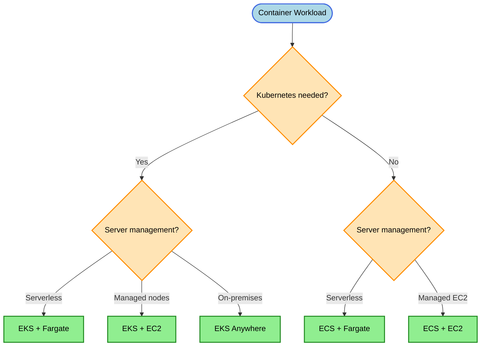
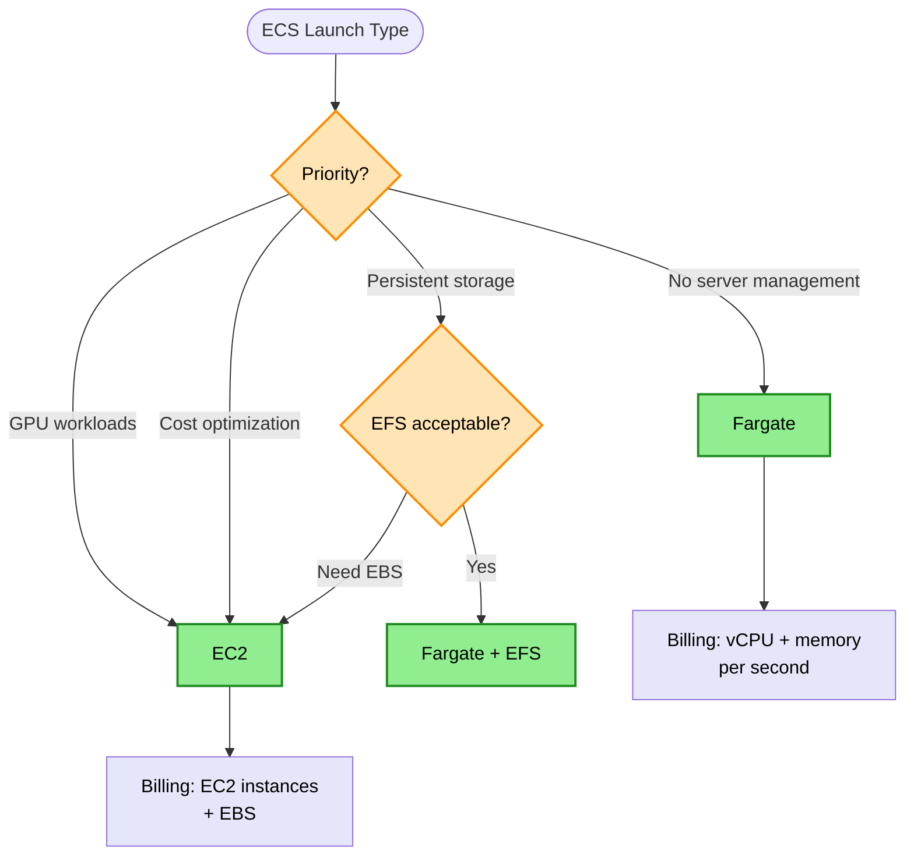
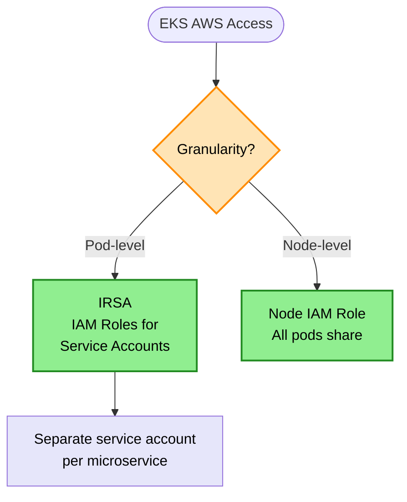

# Containers & Kubernetes Decision Tree

> **Purpose:** Choose the right AWS container service based on orchestration needs, operational requirements, and AWS integration patterns.

## Container Platform Decision



## ECS Launch Type Decision



## EKS Pod Permissions Decision



## Keyword → Service Mapping

| Keywords / Signals | AWS Service | Reasoning |
|--------------------|-------------|-----------|
| Kubernetes, portability | EKS | Managed Kubernetes |
| AWS-native orchestration | ECS | Simpler, AWS-integrated |
| serverless containers | Fargate | No server management |
| GPU workloads | ECS/EKS on EC2 | GPU instance types |
| pod-level AWS permissions | IRSA | Fine-grained IAM |
| on-premises K8s | EKS Anywhere | Consistent K8s experience |
| containers + persistent storage | Fargate + EFS | Serverless with storage |

## Elimination Rules

| Never Choose | When | Because |
|--------------|------|---------|
| Fargate | Need GPU instances | Fargate doesn't support GPU |
| ECS | Need Kubernetes API | ECS is AWS-proprietary |
| EKS | Simple container needs | Over-engineered for simple apps |
| Node IAM role | Need pod isolation | All pods share permissions |

## ECS Launch Types Comparison

| Launch Type | Billing | Management | Use Case |
|-------------|---------|------------|----------|
| Fargate | vCPU + memory per second | None | Most workloads |
| EC2 | EC2 instances + EBS | You manage instances | GPU, cost optimization |

> **Rule:** Fargate = task resource billing, no instance management

## EKS Compute Options

| Option | Management | Use Case |
|--------|------------|----------|
| Fargate | Serverless | Simple pods, no node management |
| Managed Node Groups | Semi-managed | Typical workloads |
| Self-managed Nodes | Full control | Custom AMIs, GPU |

## IRSA (IAM Roles for Service Accounts)

```
Service Account → IAM Role → Pod

Benefits:
- Pod-level AWS permissions
- Separate service account per microservice
- No shared credentials
- Follows least privilege
```

**IRSA vs Other Approaches:**

| Approach | Permission Scope | Security |
|----------|-----------------|----------|
| IRSA (recommended) | Per pod/service account | Best (least privilege) |
| Instance Profile | All pods on node | Weak (over-privileged) |
| Shared Service Account | Multiple pods | Medium |

**Example Pattern:**
```
UI Pod ──────────────────→ Service Account A → IAM Role → DynamoDB only
Data Processing Pod ─────→ Service Account B → IAM Role → S3 only
```

> **Rule:** EKS pod-level AWS permissions → IRSA (one role per service account)

## On-Premises Containers

| Requirement | Solution |
|-------------|----------|
| Data must stay on-prem | AWS Outposts + ECS/EKS |
| Kubernetes on-prem | EKS Anywhere |
| Hybrid container management | ECS Anywhere |

> **Rule:** On-prem data residency + AWS services → Outposts

## Cost Comparison

| Option | Pricing Model | Cost Efficiency |
|--------|---------------|-----------------|
| ECS on Fargate | Per vCPU/memory second | Best for variable |
| ECS on EC2 | Per EC2 instance | Best for steady |
| EKS on Fargate | Per vCPU/memory second + EKS fee | Higher, serverless |
| EKS on EC2 | Per EC2 instance + EKS fee | Highest control |

> **Note:** EKS has a $0.10/hour cluster fee. ECS control plane is free.

## Trade-off Matrix

| Aspect | ECS Fargate | ECS EC2 | EKS Fargate | EKS EC2 |
|--------|-------------|---------|-------------|---------|
| Ops Overhead | None | Medium | Low | Medium |
| Flexibility | Low | Medium | Medium | High |
| Cost (variable) | Low | Medium | Medium | High |
| Cost (steady) | Medium | Low | High | Medium |
| GPU Support | No | Yes | No | Yes |
| K8s Ecosystem | No | No | Yes | Yes |

## Real-World Scenarios

### Scenario 1: Microservices with Different AWS Permissions
**Requirement:** Each service needs different S3 buckets
**Decision:** EKS + IRSA
**Reasoning:** Pod-level IAM roles via service accounts

### Scenario 2: Simple Container Deployment
**Requirement:** Deploy containerized app, minimal ops
**Decision:** ECS Fargate
**Reasoning:** Serverless, no K8s complexity needed

### Scenario 3: GPU-Based ML Inference
**Requirement:** Container needs GPU for inference
**Decision:** ECS or EKS on EC2 with GPU instances
**Reasoning:** Fargate doesn't support GPU

### Scenario 4: Containers with Persistent Storage
**Requirement:** Container needs persistent file storage
**Decision:** ECS/EKS Fargate + EFS
**Reasoning:** EFS provides persistent, shared storage

### Scenario 5: Kubernetes on Premises
**Requirement:** Run K8s on-prem with AWS consistency
**Decision:** EKS Anywhere
**Reasoning:** Same K8s experience, on-prem deployment

### Scenario 6: Cost-Optimized Steady Workload
**Requirement:** 24/7 container workload, cost-sensitive
**Decision:** ECS on EC2 with Savings Plans
**Reasoning:** Predictable, can commit for savings

## Common Mistakes

1. **Mistake:** Using EKS for simple container deployments
   **Correct approach:** Use ECS for simpler AWS-native orchestration

2. **Mistake:** Node-level IAM for multi-tenant pods
   **Correct approach:** Use IRSA for pod-level isolation

3. **Mistake:** Fargate for GPU workloads
   **Correct approach:** Use EC2 launch type for GPU

4. **Mistake:** ECS for Kubernetes portability needs
   **Correct approach:** Use EKS for Kubernetes API compatibility

5. **Mistake:** Storing state in container filesystem
   **Correct approach:** Use EFS for persistent storage

## Container Image Security

| Tool | Purpose |
|------|---------|
| ECR Image Scanning | Vulnerability detection in images |
| Amazon Inspector | CVE scanning for ECR images |
| ECR Lifecycle Policies | Remove old/untagged images |

## EKS Node Scaling

| Component | Scales | Scope |
|-----------|--------|-------|
| HPA (Horizontal Pod Autoscaler) | Pods | Application workload |
| Cluster Autoscaler | EC2 Nodes | Infrastructure capacity |
| Karpenter | EC2 Nodes | Faster, more flexible (newer) |

**Common Issue:** HPA scales pods, but nodes don't scale.
**Cause:** Cluster Autoscaler not deployed.
**Fix:** Deploy Cluster Autoscaler integrated with ASG.

> **Rule:** EKS node auto-scaling (keep EC2) → Kubernetes Cluster Autoscaler

## EFS for Containers

| Use Case | Solution |
|----------|----------|
| Shared storage across pods | EFS |
| Persistent storage for Fargate | EFS |
| High IOPS container storage | EBS (EC2 only) |

**EFS + Fargate:**
- POSIX-compliant
- Multi-AZ by default
- Works natively with ECS and EKS Fargate

> **Rule:** "POSIX" + "Fargate" + "persistent" → EFS

## Related Decisions

- [Compute Decisions](./compute-decisions.md) - Lambda vs containers
- [Scaling Decisions](./scaling-decisions.md) - Container auto-scaling
- [Security Decisions](./security-decisions.md) - Container security

---

## Quick Reference

1. **Kubernetes needed** → EKS
2. **AWS-native, simple** → ECS
3. **Serverless containers** → Fargate
4. **GPU workloads** → EC2 launch type
5. **Pod-level AWS permissions** → IRSA
6. **Containers + persistent storage** → Fargate + EFS
7. **On-prem K8s** → EKS Anywhere
8. **On-prem with AWS services** → Outposts
9. **EKS cluster fee** → $0.10/hour
10. **ECS control plane** → Free
