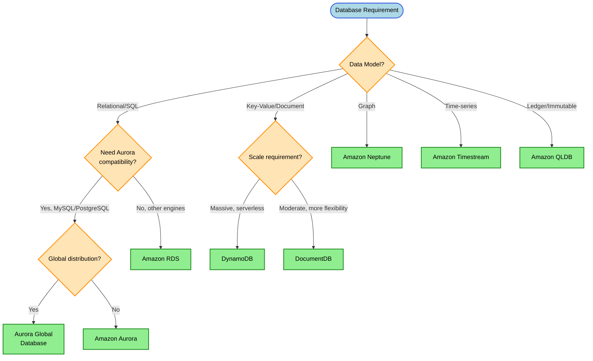
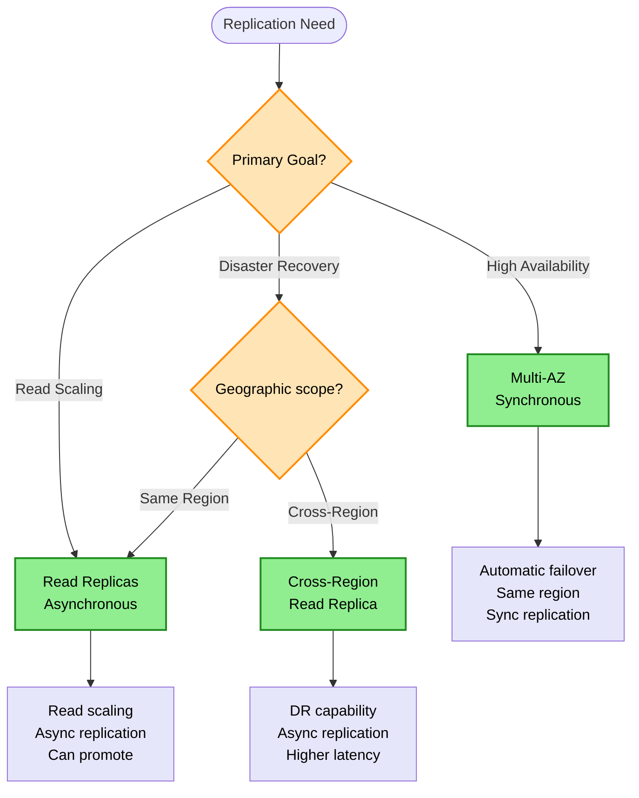
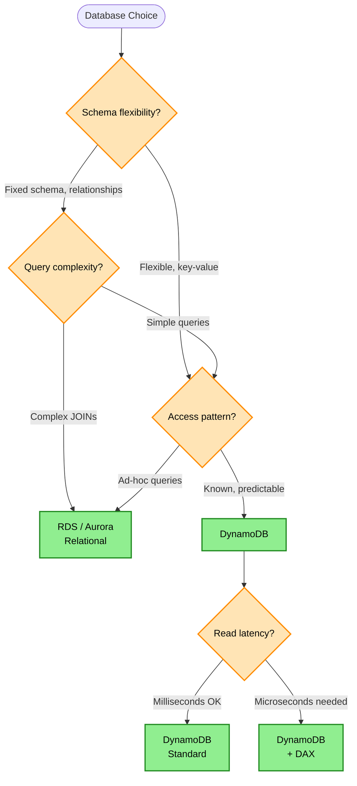

# Database Decision Tree

> **Purpose:** Choose the right AWS database service based on data model, scale requirements, latency needs, and operational complexity.

## Decision Flowchart

## Replication Decision

## DynamoDB vs RDS Decision

## Keyword → Service Mapping

| Keywords / Signals | AWS Service | Reasoning |
|--------------------|-------------|-----------|
| relational, SQL, ACID, joins | RDS / Aurora | Full SQL support |
| schema-less, massive scale | DynamoDB | Single-digit ms at any scale |
| microsecond latency, leaderboard | DynamoDB + DAX | In-memory caching |
| MySQL/PostgreSQL, 5x performance | Aurora | AWS-optimized engine |
| global reads, < 1 second RPO | Aurora Global Database | Cross-region replication |
| global tables, active-active | DynamoDB Global Tables | Multi-region writes |
| MongoDB compatibility | DocumentDB | Managed MongoDB API |
| graph, relationships | Neptune | Graph queries |
| IoT, time-series | Timestream | Built-in time functions |
| blockchain, immutable | QLDB | Cryptographic verification |

## Elimination Rules

| Never Choose | When | Because |
|--------------|------|---------|
| DynamoDB | Complex ad-hoc queries needed | No JOIN support, access patterns must be known |
| RDS | Need unlimited scale | Has scaling limits |
| Single-AZ RDS | High availability required | No automatic failover |
| Read Replica | Need sync replication | Read replicas are async |
| Aurora | Need Oracle/SQL Server | Only MySQL/PostgreSQL compatible |

## High Availability vs Read Scaling

| Feature | Multi-AZ | Read Replicas |
|---------|----------|---------------|
| Purpose | High Availability | Read Scaling |
| Replication | Synchronous | Asynchronous |
| Failover | Automatic | Manual promotion |
| Read Traffic | No | Yes |
| Regions | Same region | Same or cross-region |
| Data Lag | Zero | Seconds to minutes |

> **Key Insight:** Multi-AZ = HA (sync) | Read Replicas = Scale/DR (async)

## Aurora Global Database

| Metric | Value |
|--------|-------|
| Cross-region replication lag | <1 second |
| RPO | ~1 second |
| RTO | ~1 minute (managed failover) |
| Secondary regions | Up to 5 |
| Read replicas per region | Up to 16 |

> **Rule:** Global + relational + low RPO/RTO → Aurora Global Database

## RDS Proxy

| Benefit | Explanation |
|---------|-------------|
| Connection pooling | Reduces DB connection overhead |
| Multiplexing | Shares connections across many clients |
| Failover handling | Automatic failover, reduced impact |
| IAM authentication | No credentials in code |

**Use Cases:**
- Lambda + RDS (prevents connection storms)
- Microservices with many DB connections
- Applications with frequent short connections

> **Rule:** Too many DB connections or Lambda + RDS → RDS Proxy

## DynamoDB Capacity Modes

| Mode | Scaling | Best For |
|------|---------|----------|
| On-Demand | Instant, automatic | Unpredictable, spiky, unknown traffic |
| Provisioned + Auto-scaling | Gradual (may lag) | Predictable with gradual variations |

> **Rule:** "Spikes happen very quickly" → On-Demand. "Gradual predictable growth" → Provisioned + Auto-scaling.

## DynamoDB Protection Options

| Feature | Protects Against | Scope |
|---------|-----------------|-------|
| PITR (Point-in-Time Recovery) | Accidental writes, deletes, corruption | Data recovery, 35 days |
| Deletion Protection | Table deletion | Table only |
| On-demand Backups | Manual snapshots | Point-in-time |

> **Rule:** "Accidental deletion" + "data recovery" → PITR. "Prevent table deletion" → Deletion Protection.

## Neptune (Graph Database)

| Use Case | Query Type |
|----------|------------|
| Social networks | Friend of friend |
| Fraud detection | Relationship patterns |
| Knowledge graphs | Entity connections |
| Recommendation engines | Graph traversal |

> **Rule:** "Relationship queries" + "social graph" + "fraud detection" → Neptune

## RDS Disaster Recovery

| Scope | Solution | RTO/RPO |
|-------|----------|---------|
| Same Region HA | Multi-AZ | Automatic failover |
| Same Region Recovery | Automated Backups | Point-in-time |
| Cross-Region DR | Cross-Region Read Replicas | Async, manual promotion |
| Cross-Region Backup | Snapshot Copy | Manual |

> **Rule:** RDS automated backups stay in same region. Cross-region DR → Cross-Region Read Replicas.

## Cost Comparison

| Service | Pricing Model | Best For |
|---------|---------------|----------|
| DynamoDB On-Demand | Pay per request | Variable workloads |
| DynamoDB Provisioned | Capacity units | Predictable workloads |
| RDS | Instance hours + storage | Traditional workloads |
| Aurora | Instance hours + I/O | High performance SQL |
| Aurora Serverless | ACUs consumed | Variable SQL workloads |

## Trade-off Matrix

| Aspect | DynamoDB | RDS | Aurora | DocumentDB |
|--------|----------|-----|--------|------------|
| Scale | Unlimited | Limited | High | High |
| Latency | Single-digit ms | ms | ms | ms |
| Schema | Flexible | Fixed | Fixed | Flexible |
| Queries | Key-based | SQL | SQL | MongoDB API |
| Ops | Zero | Medium | Low | Low |
| Cost (small) | Low | Medium | Higher | Medium |
| Cost (large) | Variable | Predictable | Predictable | Predictable |

## Real-World Scenarios

### Scenario 1: E-commerce Product Catalog
**Requirement:** Variable traffic, simple lookups by product ID
**Decision:** DynamoDB
**Reasoning:** Key-value access, auto-scaling, serverless

### Scenario 2: Financial Application with Complex Reporting
**Requirement:** ACID transactions, complex JOINs, audit trails
**Decision:** Aurora PostgreSQL with Multi-AZ
**Reasoning:** Full SQL, HA, strong consistency

### Scenario 3: Gaming Leaderboard
**Requirement:** Microsecond reads, global players
**Decision:** DynamoDB + DAX + Global Tables
**Reasoning:** DAX for microsecond cache, global tables for multi-region

### Scenario 4: Social Network Connections
**Requirement:** Find friends-of-friends, relationship queries
**Decision:** Amazon Neptune
**Reasoning:** Graph database optimized for relationship traversal

### Scenario 5: IoT Sensor Data
**Requirement:** Time-series data, built-in analytics
**Decision:** Amazon Timestream
**Reasoning:** Purpose-built for time-series, automatic tiering

### Scenario 6: SQL Server Migration (Minimal Refactor)
**Requirement:** Migrate SQL Server to AWS with minimal code changes
**Decision:** Babelfish for Aurora PostgreSQL + AWS SCT/DMS
**Reasoning:** Babelfish understands T-SQL, minimal application changes

## DynamoDB Access Patterns

| Access Pattern | Design Approach |
|----------------|-----------------|
| Single item by key | Partition key lookup |
| Items by partition | Query on partition key |
| Multiple access patterns | GSI (Global Secondary Index) |
| Hierarchical data | Composite sort key |
| Many-to-many | Adjacency list pattern |

## Common Mistakes

1. **Mistake:** Using DynamoDB for ad-hoc analytics queries
   **Correct approach:** Use RDS/Athena for complex queries

2. **Mistake:** Relying on Read Replicas for HA
   **Correct approach:** Use Multi-AZ for automatic failover

3. **Mistake:** Choosing RDS when scale is unpredictable
   **Correct approach:** Use DynamoDB or Aurora Serverless

4. **Mistake:** Forgetting DAX for read-heavy DynamoDB
   **Correct approach:** Add DAX for microsecond caching

5. **Mistake:** Using DynamoDB without planning access patterns
   **Correct approach:** Design GSIs based on query patterns upfront

## Aurora vs RDS Decision

| Choose Aurora When | Choose RDS When |
|--------------------|-----------------|
| MySQL/PostgreSQL and need 5x performance | Need Oracle, SQL Server, MariaDB |
| Auto-scaling storage needed | Fixed, predictable storage |
| Fast failover (< 30s) | Standard failover OK |
| Up to 15 read replicas | Up to 5 read replicas |
| Cross-region global database | Simpler setup |

## Related Decisions

- [Caching Decisions](./caching-decisions.md) - DAX vs ElastiCache
- [Migration Decisions](./migration-decisions.md) - Database migration strategies
- [Storage Decisions](./storage-decisions.md) - Data lake vs database

---

## Quick Reference

1. **Schema-less + scale** → DynamoDB
2. **Complex SQL + JOINs** → RDS / Aurora
3. **Microsecond reads** → DynamoDB + DAX
4. **Global reads, low latency** → Aurora Global / DynamoDB Global Tables
5. **Multi-AZ** = HA (sync) | **Read Replica** = Scale (async)
6. **Graph queries** → Neptune
7. **Time-series** → Timestream
8. **"Minimal refactor" from SQL Server** → Babelfish + Aurora PostgreSQL
