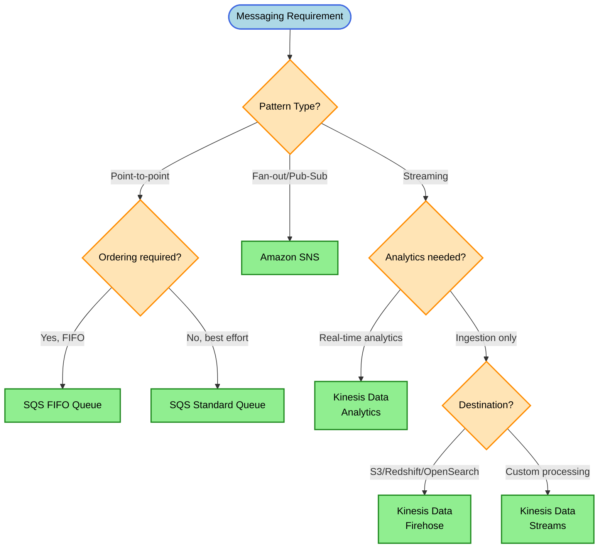
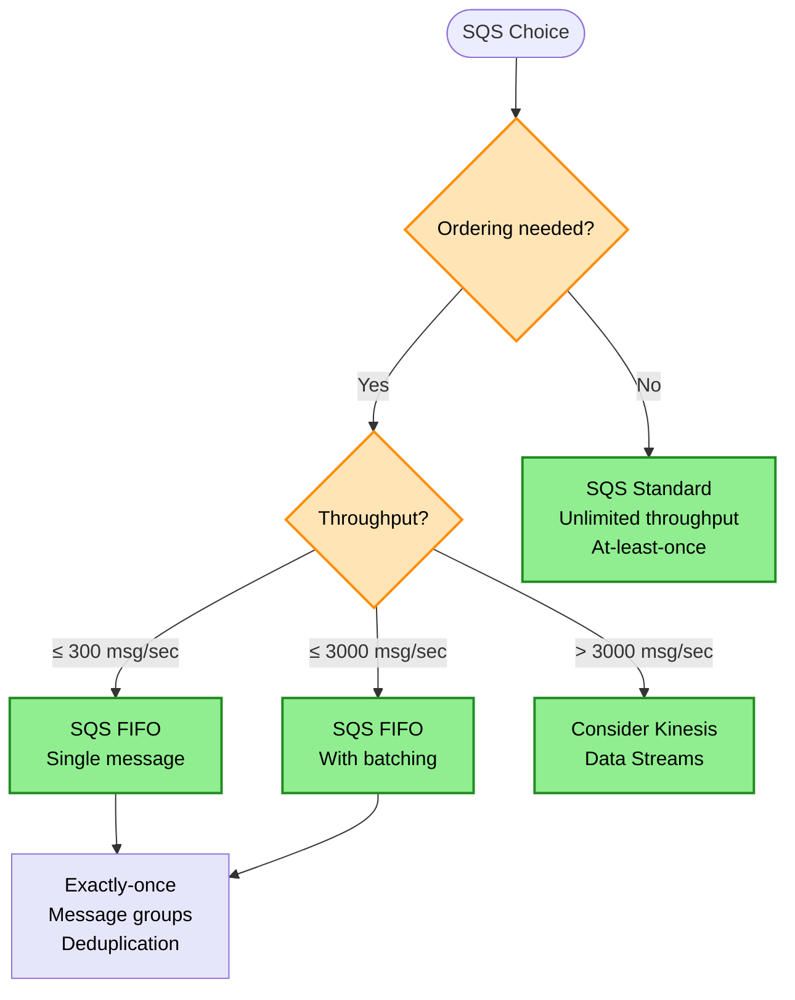
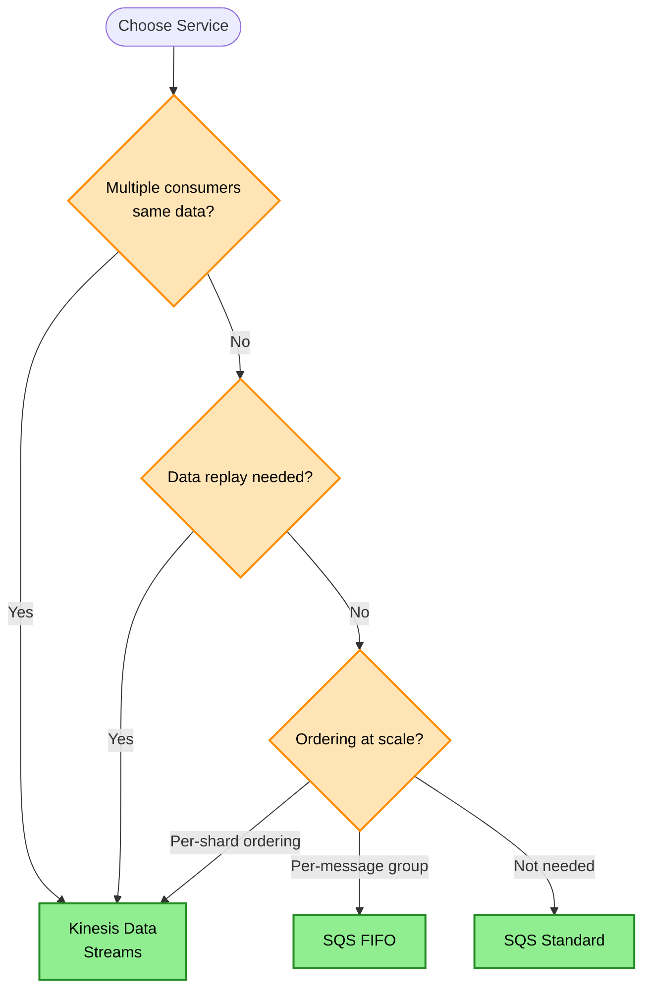

# Messaging & Streaming Decision Tree

> **Purpose:** Choose the right AWS messaging or streaming service based on ordering requirements, throughput, delivery guarantees, and processing patterns.

## Decision Flowchart



## SQS Decision



## Kinesis vs SQS Decision



## Keyword → Service Mapping

| Keywords / Signals | AWS Service | Reasoning |
|--------------------|-------------|-----------|
| decoupling, buffering, queue | SQS Standard | Simple queue, unlimited throughput |
| exactly-once, FIFO, ordering | SQS FIFO | Guaranteed ordering and deduplication |
| fan-out, pub/sub, multiple subscribers | SNS | One-to-many messaging |
| streaming, real-time, ordering at scale | Kinesis Data Streams | Ordered by partition key |
| load to S3/Redshift automatically | Kinesis Firehose | Managed delivery |
| real-time streaming analytics | Kinesis Data Analytics | SQL on streams |
| event-driven, loose coupling | EventBridge | Event routing with rules |
| IoT device messages | IoT Core | Device protocol support |

## Elimination Rules

| Never Choose | When | Because |
|--------------|------|---------|
| SQS Standard | Strict ordering required | Best-effort ordering only |
| SQS FIFO | Throughput > 3000 msg/sec (batched) | Hard limit |
| SNS alone | Need message persistence | SNS doesn't store messages |
| Kinesis | Simple queue use case | Over-engineered |
| Firehose | Need to write to DynamoDB | Firehose doesn't support DynamoDB |

## Delivery Guarantees Comparison

| Service | Delivery | Ordering | Deduplication |
|---------|----------|----------|---------------|
| SQS Standard | At-least-once | Best effort | None |
| SQS FIFO | Exactly-once | Guaranteed (per group) | 5-minute window |
| SNS | At-least-once | None | None |
| Kinesis | At-least-once | Per shard | None |
| EventBridge | At-least-once | None | None |

## Throughput Comparison

| Service | Throughput |
|---------|------------|
| SQS Standard | Unlimited |
| SQS FIFO | 300 msg/sec (3000 batched) |
| SNS | Very high |
| Kinesis | 1 MB/sec or 1000 records/sec per shard |
| EventBridge | Very high |

## Kinesis Enhanced Fan-Out

| Mode | Throughput | Latency | Use Case |
|------|------------|---------|----------|
| Standard | 2 MB/sec shared across consumers | Higher | Few consumers |
| Enhanced Fan-Out | 2 MB/sec per consumer | ~70ms | Multiple consumers, consistent performance |

> **Rule:** Multiple Kinesis consumers + performance lag → Enable Enhanced Fan-Out

## S3 Event Integration Patterns

| Pattern | Speed | Complexity |
|---------|-------|------------|
| S3 Event → Lambda → Target | Fastest | Low |
| S3 → EventBridge → Lambda → Target | Fast (more filtering) | Medium |
| S3 → SNS → Target | Fast | Medium |

**S3 Cannot Directly Invoke:**
- Kinesis Data Streams
- Any service other than Lambda, SNS, SQS, EventBridge

> **Rule:** S3 → Kinesis fastest path: S3 Event Notification → Lambda → Kinesis Data Streams

## Cost Comparison

| Service | Pricing Model | Cost Efficiency |
|---------|---------------|-----------------|
| SQS | Per request | Low volume = cheap |
| SNS | Per publish + delivery | Cheap for fan-out |
| Kinesis Streams | Per shard hour + data | Higher minimum cost |
| Kinesis Firehose | Per GB ingested | Good for high volume |
| EventBridge | Per event | Low volume = cheap |

## Trade-off Matrix

| Aspect | SQS | SNS | Kinesis | EventBridge |
|--------|-----|-----|---------|-------------|
| Pattern | Queue | Pub/Sub | Stream | Event Bus |
| Ordering | FIFO only | None | Per shard | None |
| Replay | No | No | Yes | Yes (archive) |
| Throughput | Unlimited* | Very High | Per shard | Very High |
| Retention | 14 days max | None | 365 days | Archive |
| Consumers | 1 per message | Many | Many | Rule-based |

*Standard queue; FIFO has limits

## Real-World Scenarios

### Scenario 1: Order Processing (Decoupled)
**Requirement:** Decouple order service from fulfillment
**Decision:** SQS Standard
**Reasoning:** Simple buffering, at-least-once is fine with idempotency

### Scenario 2: Form Submissions (Exactly-Once)
**Requirement:** Prevent duplicate form submissions
**Decision:** SQS FIFO with deduplication
**Reasoning:** Exactly-once processing, content-based deduplication

### Scenario 3: Notification System
**Requirement:** Send to email, SMS, and mobile push
**Decision:** SNS with multiple subscriptions
**Reasoning:** Fan-out to different endpoints

### Scenario 4: Real-Time Clickstream
**Requirement:** 100,000 events/sec, multiple analytics consumers
**Decision:** Kinesis Data Streams
**Reasoning:** High throughput, multiple consumers, replay capability

### Scenario 5: Log Aggregation to S3
**Requirement:** Collect logs and deliver to S3 hourly
**Decision:** Kinesis Data Firehose
**Reasoning:** Managed delivery, automatic batching, no code

### Scenario 6: Mobile Game Leaderboard Updates
**Requirement:** Ordered processing per user, massive scale
**Decision:** Kinesis Data Streams (partition by user_id)
**Reasoning:** Ordering per partition key, high throughput

### Scenario 7: Microservices Event Routing
**Requirement:** Route events based on content to different services
**Decision:** EventBridge with rules
**Reasoning:** Content-based routing, serverless integration

## SQS FIFO Throughput Math

| Mode | Throughput |
|------|------------|
| Single message | 300 msg/sec per group |
| Batch (10 messages) | 3000 msg/sec per group |
| High throughput mode | 30,000 msg/sec (preview) |

**Example:** Need 100 msg/sec ordered?
- Use FIFO with batching of 2 = ✅ Works
- No batching = ✅ Works

## Common Mistakes

1. **Mistake:** Using SQS Standard when order matters
   **Correct approach:** Use SQS FIFO for guaranteed ordering

2. **Mistake:** Expecting SNS to store messages
   **Correct approach:** Combine SNS → SQS for durability

3. **Mistake:** Using Kinesis for simple queue patterns
   **Correct approach:** SQS is simpler and often cheaper

4. **Mistake:** Assuming SQS FIFO is unlimited throughput
   **Correct approach:** Know the 300/3000 limits

5. **Mistake:** Using Firehose to write to DynamoDB
   **Correct approach:** Firehose doesn't support DynamoDB; use Lambda

## SNS + SQS Pattern (Fan-Out with Durability)

```
Producer → SNS Topic
              ├── SQS Queue A → Consumer A
              ├── SQS Queue B → Consumer B
              └── Lambda → Consumer C
```

**Benefits:**
- SNS provides fan-out
- SQS provides durability and buffering per consumer
- Each consumer processes independently

## Amazon MQ (Protocol Compatibility)

| Protocol | AWS Service | Use Case |
|----------|-------------|----------|
| AMQP | Amazon MQ (RabbitMQ) | RabbitMQ migration |
| MQTT | IoT Core, Amazon MQ | IoT devices |
| JMS | Amazon MQ (ActiveMQ) | Java messaging apps |
| Kafka | Amazon MSK | Kafka migration |
| Proprietary (AWS) | SQS, SNS | New applications |

**Migration Decision:**
```
Current protocol?
├── AMQP/MQTT/JMS → Amazon MQ (drop-in compatible)
├── Kafka → Amazon MSK
└── Custom/flexible → SQS/SNS (may need code changes)
```

> **Rule:** AMQP compatibility + minimal code changes → Amazon MQ

## SNS to Lambda Throttling

| Component | Scales? | Limit |
|-----------|---------|-------|
| SNS | Yes | Very high |
| Lambda | Yes, but | Account concurrency quota |

**When SNS → Lambda fails at high throughput:**
- SNS scales fine
- Lambda hits concurrency quota
- Solution: Contact AWS Support to raise Lambda limit

> **Rule:** SNS delivery issues at high volume → check downstream subscriber limits (Lambda concurrency)

## Related Decisions

- [Compute Decisions](./compute-decisions.md) - Lambda with SQS/Kinesis
- [Database Decisions](./database-decisions.md) - Stream to database
- [Analytics Decisions](./analytics-decisions.md) - Real-time analytics

---

## Quick Reference

1. **Ordering required** → SQS FIFO (≤ 3000/sec) or Kinesis
2. **Exactly-once** → SQS FIFO
3. **Fan-out to many** → SNS
4. **Multiple consumers same data** → Kinesis (not SQS)
5. **Data replay needed** → Kinesis
6. **Load to S3/Redshift** → Kinesis Firehose
7. **Real-time SQL analytics** → Kinesis Data Analytics
8. **Standard SQS** = At-least-once, best-effort order
