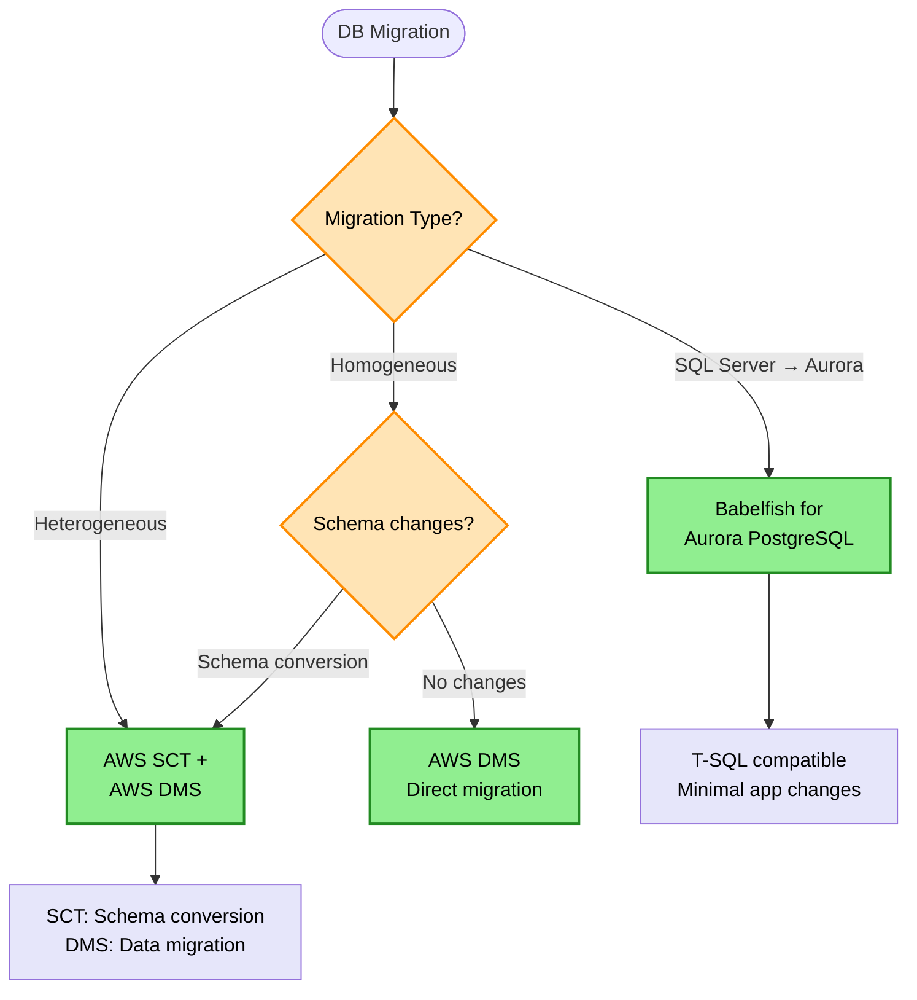
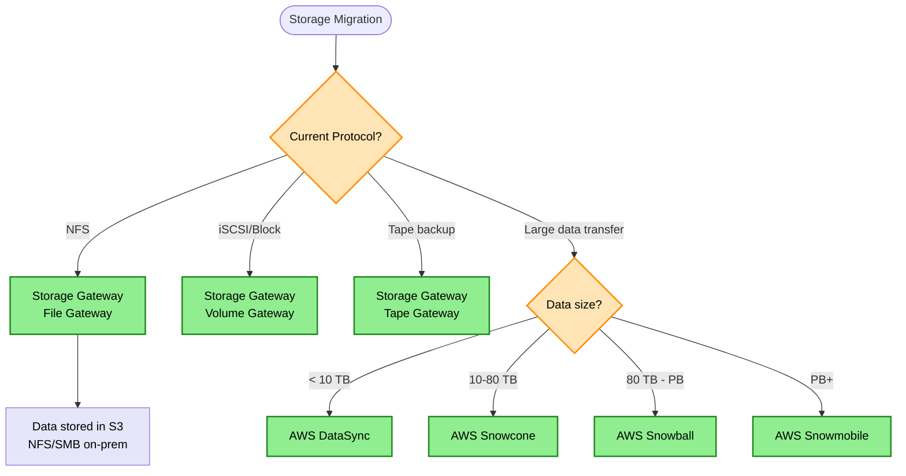
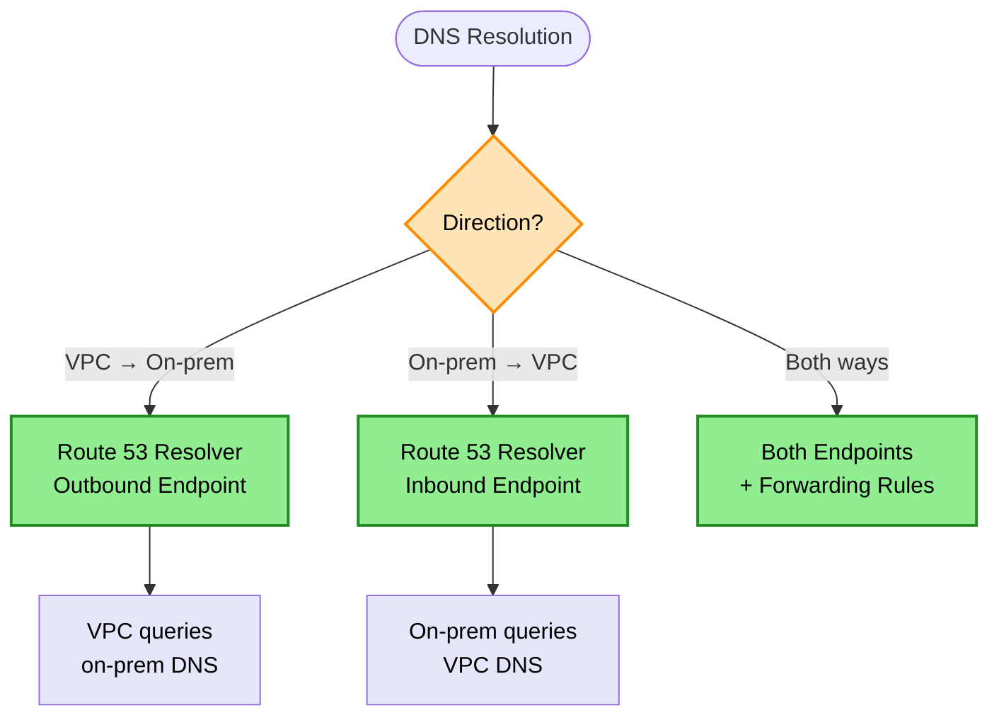

# Migration Decision Tree

> **Purpose:** Choose the right AWS migration strategy and services for database migrations, application migrations, and hybrid connectivity.

## Database Migration Decision



## On-Premises to Cloud Storage



## Hybrid DNS Resolution



## Keyword → Service Mapping

| Keywords / Signals | AWS Service | Reasoning |
|--------------------|-------------|-----------|
| database migration, same engine | AWS DMS | Direct replication |
| Oracle → PostgreSQL, schema change | AWS SCT + DMS | Schema conversion needed |
| SQL Server → Aurora, minimal refactor | Babelfish | T-SQL compatibility |
| NFS to S3 | Storage Gateway File | Protocol translation |
| 50 TB migration | Snowball | Network would take too long |
| VPC query on-prem DNS | Route 53 Outbound Resolver | Forwarding rules |
| continuous sync, on-prem to AWS | DataSync | Scheduled transfers |
| hybrid Active Directory | AD Connector | No replication |

## Elimination Rules

| Never Choose | When | Because |
|--------------|------|---------|
| DMS alone | Heterogeneous migration | Need SCT for schema |
| Snowball | < 10 TB | DataSync/Direct Transfer faster |
| Network transfer | PB scale | Would take months/years |
| Inbound Resolver | VPC → on-prem DNS | Use Outbound for that |
| Managed AD | Just need SSO to existing AD | AD Connector is lighter |

## Database Migration Paths

| Source | Target | Tools |
|--------|--------|-------|
| Oracle → Oracle RDS | Homogeneous | DMS |
| Oracle → Aurora PostgreSQL | Heterogeneous | SCT + DMS |
| SQL Server → SQL Server RDS | Homogeneous | DMS |
| SQL Server → Aurora PostgreSQL | Heterogeneous | Babelfish or SCT + DMS |
| MySQL → Aurora MySQL | Compatible | DMS |
| MongoDB → DocumentDB | Compatible | DMS |

## Storage Gateway Types

| Gateway | Protocol | Backend | Use Case |
|---------|----------|---------|----------|
| File Gateway | NFS/SMB | S3 | File shares to cloud |
| Volume Gateway | iSCSI | S3 + EBS | Block storage |
| Tape Gateway | VTL | S3 Glacier | Backup archives |

## Snow Family Comparison

| Device | Capacity | Use Case |
|--------|----------|----------|
| Snowcone | 8 TB | Edge computing, small transfers |
| Snowball Edge Storage | 80 TB | Medium migrations |
| Snowball Edge Compute | 42 TB + compute | Edge processing |
| Snowmobile | 100 PB | Data center migrations |

## Snowball Target Limitations

| Snowball Can Target | Snowball Cannot Target |
|---------------------|------------------------|
| S3 Standard | Glacier (directly) |
| S3 Standard-IA | Glacier Deep Archive (directly) |

**Correct Pattern:**
```
Snowball → S3 Standard → Lifecycle Policy → Glacier Deep Archive (same day)
```

> **Rule:** Snowball cannot write directly to Glacier. Use S3 + lifecycle policy.

## DataSync Connectivity Options

| Connection | Endpoint Type | Use Case |
|------------|---------------|----------|
| Public internet | Public endpoint | Simple setup |
| Direct Connect | VPC endpoint (PrivateLink) | Private, secure path |
| VPN | VPC endpoint (PrivateLink) | Encrypted path |

> **Rule:** On-prem NFS to EFS + Direct Connect → DataSync + PrivateLink VPC endpoint

## Trade-off Matrix

| Aspect | DataSync | Snowball | Direct Transfer |
|--------|----------|----------|-----------------|
| Speed | Network-limited | Days shipping | Network-limited |
| Data Size | < 10 TB | 10 TB - PB | Small |
| Cost | Transfer fees | Device rental | Transfer fees |
| Setup | Minutes | Days | Minutes |

## Real-World Scenarios

### Scenario 1: Oracle to Aurora PostgreSQL
**Requirement:** Migrate Oracle DB with minimal downtime
**Decision:** AWS SCT for schema + AWS DMS for data
**Reasoning:** Heterogeneous migration requires conversion

### Scenario 2: SQL Server with Minimal Code Changes
**Requirement:** Move SQL Server to AWS, keep T-SQL code
**Decision:** Babelfish for Aurora PostgreSQL
**Reasoning:** T-SQL compatibility, minimal app changes

### Scenario 3: On-Prem NFS to S3
**Requirement:** Keep NFS interface, store in S3
**Decision:** Storage Gateway File Gateway
**Reasoning:** Protocol translation, S3 tiering

### Scenario 4: 50 TB Data Center Migration
**Requirement:** Move 50 TB to AWS quickly
**Decision:** AWS Snowball Edge
**Reasoning:** Network would take weeks

### Scenario 5: VPC Resolving On-Prem DNS
**Requirement:** Lambda in VPC must resolve internal.corp
**Decision:** Route 53 Resolver Outbound Endpoint
**Reasoning:** Forward queries to on-prem DNS

### Scenario 6: Hybrid AD with IAM Identity Center
**Requirement:** SSO using existing AD, no replication
**Decision:** AD Connector + IAM Identity Center
**Reasoning:** Lightweight, no directory sync

## Migration Time Estimates

| Data Size | 100 Mbps | 1 Gbps | Snowball |
|-----------|----------|--------|----------|
| 1 TB | 1 day | 2 hours | Overkill |
| 10 TB | 10 days | 1 day | 1 week total |
| 100 TB | 100 days | 10 days | 2 weeks total |
| 1 PB | 3 years | 100 days | Snowmobile |

## Common Mistakes

1. **Mistake:** Using DMS alone for Oracle → PostgreSQL
   **Correct approach:** Use SCT first for schema conversion

2. **Mistake:** Network transfer for 50+ TB
   **Correct approach:** Use Snowball family

3. **Mistake:** Inbound Resolver for VPC → on-prem
   **Correct approach:** Use Outbound Resolver

4. **Mistake:** Managed Microsoft AD just for SSO
   **Correct approach:** AD Connector is simpler

5. **Mistake:** Ignoring Babelfish for SQL Server migrations
   **Correct approach:** Consider Babelfish for minimal refactor

## DMS Migration Types

| Type | Use Case | Downtime |
|------|----------|----------|
| Full load | Initial migration | During transfer |
| Full load + CDC | Minimal downtime | Brief cutover |
| CDC only | Ongoing replication | Zero |

CDC = Change Data Capture

## Related Decisions

- [Database Decisions](./database-decisions.md) - Target database selection
- [Networking Decisions](./networking-decisions.md) - Hybrid connectivity
- [Storage Decisions](./storage-decisions.md) - S3 vs EFS target

---

## Quick Reference

1. **Same engine migration** → DMS alone
2. **Different engines** → SCT + DMS
3. **SQL Server minimal refactor** → Babelfish
4. **NFS → S3** → File Gateway
5. **Large data (>10TB)** → Snowball
6. **VPC → on-prem DNS** → Outbound Resolver
7. **On-prem → VPC DNS** → Inbound Resolver
8. **Hybrid AD SSO** → AD Connector + Identity Center
