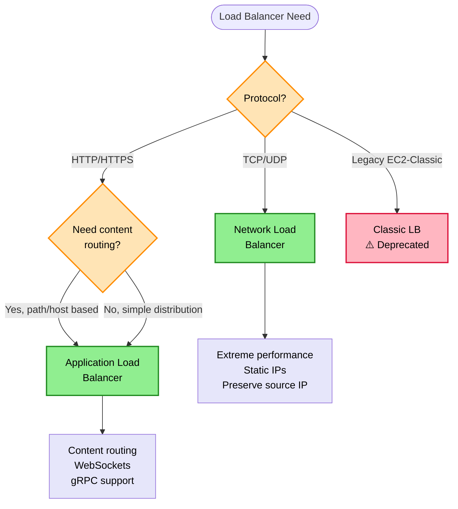
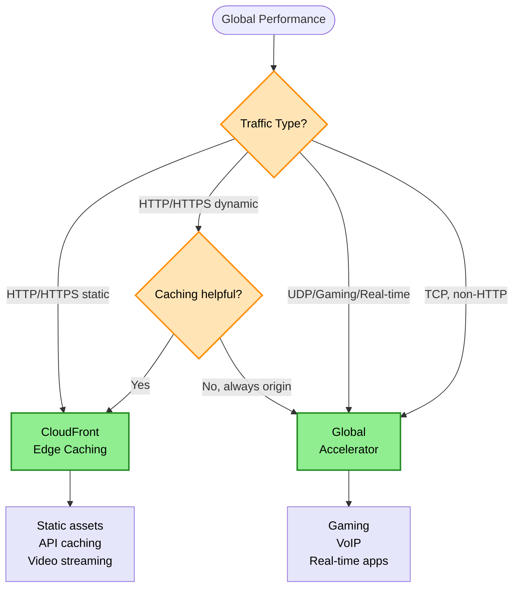
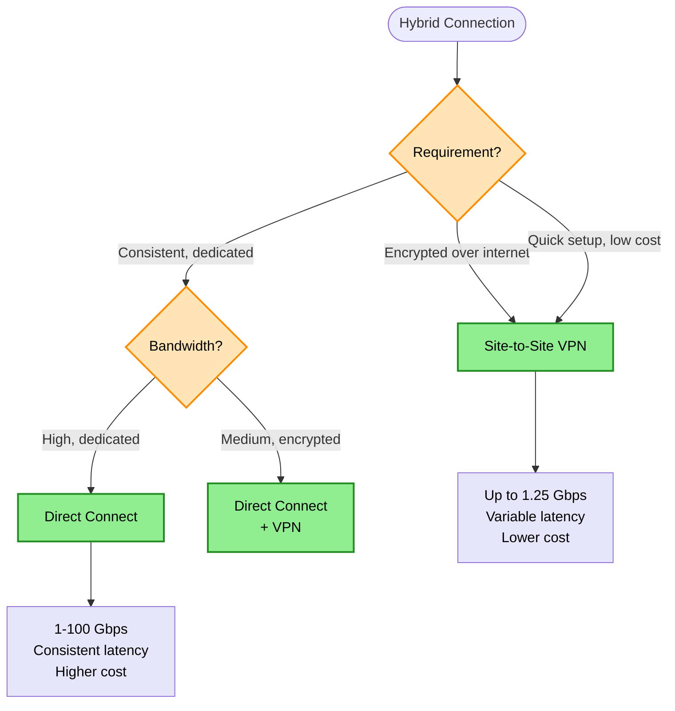
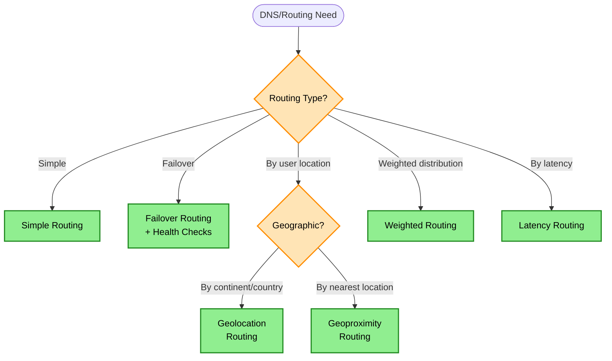
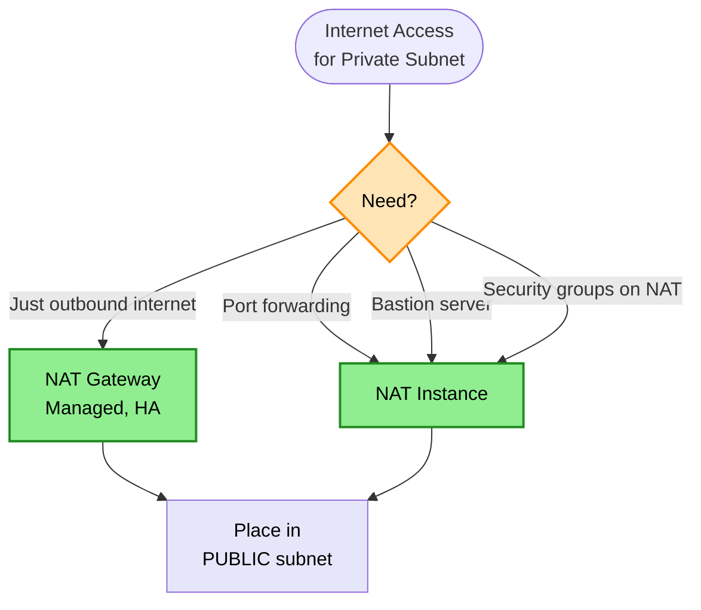
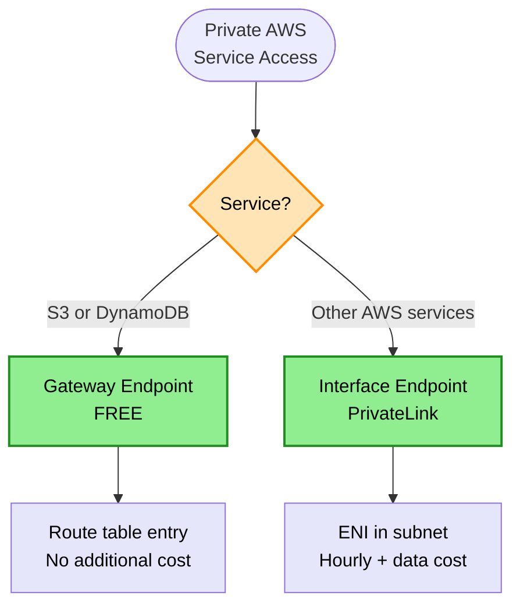

# Networking Decision Tree

> **Purpose:** Choose the right AWS networking service for load balancing, global distribution, content delivery, hybrid connectivity, and DNS management.

## Load Balancer Decision



## Global Performance Decision



## Hybrid Connectivity Decision



## DNS & Routing Decision



## NAT Gateway vs NAT Instance Decision



## NAT Gateway vs NAT Instance Comparison

| Feature | NAT Gateway | NAT Instance |
|---------|-------------|--------------|
| Security Groups | ❌ No | ✅ Yes |
| Port Forwarding | ❌ No | ✅ Yes |
| Bastion Server | ❌ No | ✅ Yes |
| Managed | ✅ Yes | ❌ No |
| High Availability | ✅ Built-in | ❌ Manual |
| Bandwidth | Up to 45 Gbps | Instance-dependent |

> **Rule:** Private subnet IPv4 internet → NAT Gateway in PUBLIC subnet

## VPC Endpoints Decision



## VPC Endpoint Types

| Type | Services | Cost | Implementation |
|------|----------|------|----------------|
| Gateway Endpoint | S3, DynamoDB only | Free | Route table entry |
| Interface Endpoint | Most AWS services | Hourly + data | ENI with PrivateLink |

> **Rules:**
> - S3/DynamoDB private access → Gateway Endpoint (free)
> - SQS/SNS/other services private access → Interface Endpoint

## Security Groups - Valid Sources

| Valid Source | Example |
|--------------|---------|
| IP address | `10.0.0.1/32` |
| CIDR block | `10.0.0.0/16` |
| Security Group ID | `sg-12345678` |
| Prefix List | `pl-12345678` |

| Invalid Source | Never Use |
|----------------|-----------|
| Internet Gateway ID | ❌ |
| NAT Gateway ID | ❌ |
| Route Table ID | ❌ |

## Security Group Tier Pattern

```
Internet → ALB SG (443 from 0.0.0.0/0) → EC2 SG (80 from ALB SG) → RDS SG (3306 from EC2 SG)
```

> **Rule:** Reference SG IDs between tiers (not CIDRs). DB tier: NEVER allow 0.0.0.0/0

## Common Ports Reference

| Service | Port |
|---------|------|
| HTTP | 80 |
| HTTPS | 443 |
| SSH | 22 |
| RDP | 3389 |
| MySQL/Aurora | 3306 |
| PostgreSQL | 5432 |
| MSSQL | 1433 |
| Oracle | 1521 |
| Redis | 6379 |
| Memcached | 11211 |
| NFS | 2049 |
| SMB | 445 |

## Keyword → Service Mapping

| Keywords / Signals | AWS Service | Reasoning |
|--------------------|-------------|-----------|
| HTTP, path-based, host-based routing | ALB | Layer 7 content routing |
| TCP, UDP, extreme performance | NLB | Layer 4, static IPs |
| WebSockets, gRPC | ALB | Protocol support |
| static content, edge caching | CloudFront | CDN with edge locations |
| UDP, gaming, real-time | Global Accelerator | Anycast, no caching |
| geo-blocking by country | WAF or CloudFront geo-restriction | Content access control |
| dedicated, consistent bandwidth | Direct Connect | Private, dedicated line |
| encrypted, over internet | Site-to-Site VPN | IPsec tunnel |
| DNS failover | Route 53 + health checks | Automatic failover |
| private subnet internet (IPv4) | NAT Gateway in public subnet | Outbound only |
| S3 private access | Gateway Endpoint | Free, route table |
| SQS/SNS private access | Interface Endpoint | PrivateLink |

## Elimination Rules

| Never Choose | When | Because |
|--------------|------|---------|
| ALB | Non-HTTP protocols (TCP/UDP) | ALB is Layer 7 only |
| NLB | Need content-based routing | NLB doesn't inspect content |
| NLB | Need WAF integration | WAF only works with ALB/CloudFront |
| Route 53 alone | Need UDP acceleration | Route 53 is DNS only |
| CloudFront | UDP traffic | CloudFront is HTTP/HTTPS only |
| VPN | Need consistent, high bandwidth | VPN goes over internet |
| Security Groups | Need geo-blocking | SGs don't understand geography |
| Security Groups | API Gateway IP restriction | Use Resource Policy |
| NAT Gateway | Need port forwarding or bastion | NAT Gateway doesn't support these |
| Interface Endpoint | S3 or DynamoDB access | Use Gateway Endpoint (free) |

## ALB vs NLB Comparison

| Feature | ALB | NLB |
|---------|-----|-----|
| Layer | 7 (HTTP/HTTPS) | 4 (TCP/UDP) |
| Routing | Path, host, header | Port only |
| WebSocket | Yes | Yes |
| Static IP | No (use Global Accelerator) | Yes |
| Performance | High | Extreme (millions rps) |
| Source IP | X-Forwarded-For header | Preserved |
| SSL Termination | Yes | Yes (TLS) |
| Cost | Per LCU | Per NLCU |
| WAF Integration | ✅ Yes | ❌ No |

## NLB Target Registration

| Target Type | Routing |
|-------------|---------|
| Instance ID | Routes via primary private IP |
| IP targets | Direct IP routing |

> **Rule:** NLB instance targets → routes via private IP

## CloudFront vs Global Accelerator

| Aspect | CloudFront | Global Accelerator |
|--------|------------|-------------------|
| Traffic | HTTP/HTTPS | TCP/UDP |
| Caching | Yes | No |
| Edge Location | 400+ PoPs | AWS edge network |
| Use Case | Static content, APIs | Gaming, VoIP, real-time |
| Static IPs | No | Yes (anycast) |
| Origin | S3, ALB, custom | ALB, NLB, EC2, EIP |

## Cost Comparison

| Service | Pricing Model | Notes |
|---------|---------------|-------|
| ALB | Per hour + LCU | LCU based on connections, rules, data |
| NLB | Per hour + NLCU | NLCU based on connections, data |
| CloudFront | Per request + data out | Free tier available |
| Global Accelerator | Per hour + data processed | Fixed IP cost |
| Direct Connect | Per port hour + data out | Higher setup, lower data costs |
| VPN | Per connection hour + data | Low fixed cost |

## Trade-off Matrix

| Aspect | ALB | NLB | CloudFront | Global Accelerator |
|--------|-----|-----|------------|-------------------|
| Latency | Low | Very Low | Lowest (cached) | Low |
| Throughput | High | Extreme | Very High | High |
| Caching | No | No | Yes | No |
| Static IP | No | Yes | No | Yes |
| Global | No | No | Yes | Yes |
| Cost | Medium | Low | Variable | Medium |

## Real-World Scenarios

### Scenario 1: Microservices API Gateway
**Requirement:** Route /api/users to User Service, /api/orders to Order Service
**Decision:** Application Load Balancer
**Reasoning:** Path-based routing at Layer 7

### Scenario 2: Gaming Server
**Requirement:** UDP traffic, low latency, global players
**Decision:** Global Accelerator → NLB → Game Servers
**Reasoning:** UDP support, anycast IPs, edge optimization

### Scenario 3: Static Website
**Requirement:** Serve HTML/CSS/JS globally with low latency
**Decision:** S3 + CloudFront
**Reasoning:** Edge caching, HTTPS, cost-effective

### Scenario 4: Block Access by Country
**Requirement:** Restrict video content to USA only
**Decision:** CloudFront with geo-restriction
**Reasoning:** Built-in geo-blocking feature

### Scenario 5: Hybrid Cloud (Predictable Performance)
**Requirement:** Connect data center to AWS, consistent latency
**Decision:** Direct Connect
**Reasoning:** Dedicated bandwidth, no internet variability

### Scenario 6: Cross-Account Private Service Access
**Requirement:** Expose RDS to partner account without internet
**Decision:** NLB + AWS PrivateLink
**Reasoning:** Private, secure, scalable service endpoint

## Route 53 Routing Policies

| Policy | Use Case | Health Checks |
|--------|----------|---------------|
| Simple | Single resource | No |
| Failover | Active-passive DR | Yes |
| Geolocation | Content by country | Optional |
| Geoproximity | Shift traffic by bias | Optional |
| Latency | Lowest latency region | Optional |
| Weighted | A/B testing, blue-green | Optional |
| Multivalue | Multiple healthy resources | Yes |

## Common Mistakes

1. **Mistake:** Using Route 53 for performance acceleration
   **Correct approach:** Use CloudFront or Global Accelerator

2. **Mistake:** Expecting ALB to handle UDP traffic
   **Correct approach:** Use NLB for UDP

3. **Mistake:** Using Security Groups for geo-blocking
   **Correct approach:** Use WAF or CloudFront geo-restriction

4. **Mistake:** CloudFront for all dynamic content
   **Correct approach:** CloudFront with 0 TTL or Global Accelerator

5. **Mistake:** VPN for high-bandwidth, consistent needs
   **Correct approach:** Direct Connect for dedicated bandwidth

## VPC Connectivity Patterns

| Need | Solution |
|------|----------|
| VPC to VPC (same region) | VPC Peering |
| VPC to VPC (cross-region) | Transit Gateway |
| VPC to on-premises | VPN or Direct Connect |
| VPC to many VPCs | Transit Gateway |
| Private AWS service access | VPC Endpoints |
| Cross-account service | PrivateLink |
| Share VPC subnets (cheapest) | Resource Access Manager (RAM) |

## Private Hosted Zone Requirements

| VPC Setting | Required |
|-------------|----------|
| enableDnsHostnames | Yes |
| enableDnsSupport | Yes |

> **Rule:** Private hosted zone not resolving → check VPC DNS settings first. Both settings must be enabled.

## Multi-Account VPC Patterns

| Pattern | Use Case | Implementation |
|---------|----------|----------------|
| Hub-and-spoke | Centralized services | Transit Gateway |
| Shared Services VPC | Common tooling | Transit Gateway + shared VPC |
| VPC Sharing | Cost optimization | RAM (share subnets) |
| Full mesh | Legacy (avoid) | VPC Peering (doesn't scale) |

> **Rules:**
> - Many VPCs → Transit Gateway (not full-mesh peering)
> - Shared tooling → Shared Services VPC
> - Cheapest cross-account → RAM (VPC Sharing)

## DNS TTL Caching

| Situation | Impact |
|-----------|--------|
| DNS record updated | Clients use cached IP until TTL expires |
| Low TTL (60s) | Faster propagation, more DNS queries |
| High TTL (24h) | Slower propagation, fewer DNS queries |

> **Rule:** DNS change not taking effect → TTL caching. Lower TTL before migrations.

## PrivateLink for Third-Party SaaS

| Approach | Traffic Path | Security |
|----------|--------------|----------|
| PrivateLink | AWS network only | Best (no public internet) |
| VPC Peering | Direct VPC connection | Good (bidirectional) |
| Internet | Public internet | Lowest |

**PrivateLink Benefits:**
- Unidirectional (consumer → provider)
- No CIDR overlap concerns
- Private DNS resolution

> **Rule:** Private access to third-party AWS-hosted SaaS → PrivateLink

## Cross-Zone Load Balancing

| Setting | Traffic Distribution |
|---------|---------------------|
| Enabled | Evenly across ALL targets |
| Disabled | Evenly across AZs first, then targets |

**Example (2 AZs, 4 + 6 targets):**
- Enabled: Each target gets ~10%
- Disabled: AZ-A targets get 12.5%, AZ-B targets get ~8.3%

> **Rule:** Cross-zone disabled + uneven targets = uneven distribution per target

## Hybrid Connectivity Encryption

| Option | Encryption |
|--------|------------|
| Site-to-Site VPN | Yes (IPsec) |
| Direct Connect | No (add VPN or MACsec) |
| DX + VPN | Yes |

> **Rule:** "Encrypted at network layer" → Site-to-Site VPN (not DX alone)

## Related Decisions

- [Security Decisions](./security-decisions.md) - WAF, Shield
- [Compute Decisions](./compute-decisions.md) - Load balancing targets
- [Caching Decisions](./caching-decisions.md) - CloudFront caching

---

## Quick Reference

1. **HTTP content routing** → ALB
2. **TCP/UDP extreme performance** → NLB
3. **Global HTTP caching** → CloudFront
4. **Global UDP/gaming** → Global Accelerator
5. **Geo-blocking** → WAF or CloudFront
6. **Dedicated hybrid** → Direct Connect
7. **DNS failover** → Route 53 + health checks
8. **Cross-account private** → PrivateLink
9. **Private subnet internet (IPv4)** → NAT Gateway in PUBLIC subnet
10. **S3/DynamoDB private access** → Gateway Endpoint (free)
11. **Other AWS services private** → Interface Endpoint
12. **Port forwarding/bastion** → NAT Instance (not NAT Gateway)
13. **WAF requirement** → ALB or CloudFront (not NLB)
14. **API Gateway IP restriction** → Resource Policy (not SGs)
15. **CloudFront has no security groups** → Use WAF
