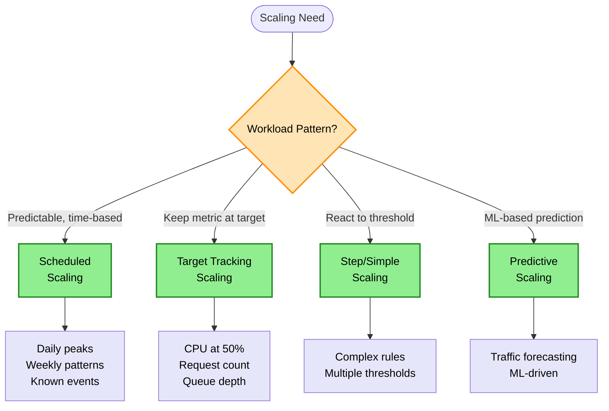
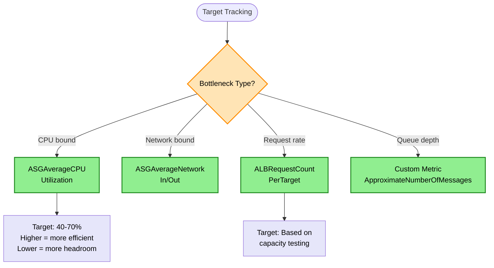
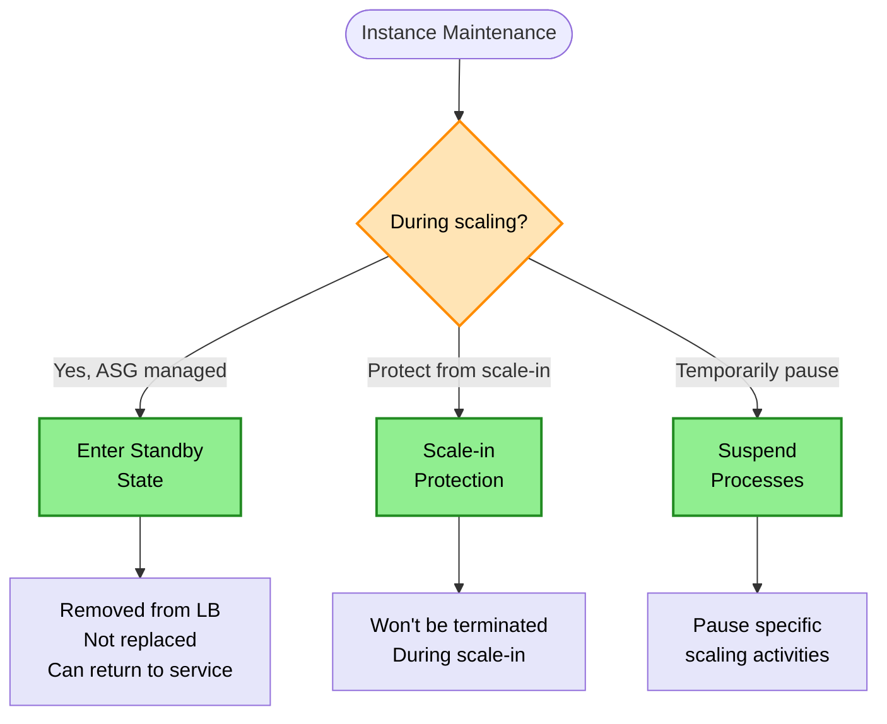

# Scaling Decision Tree

> **Purpose:** Choose the right AWS scaling strategy based on workload patterns, response time requirements, and cost optimization goals.

## Auto Scaling Policy Decision



## Target Tracking Metric Decision



## Instance Maintenance Decision



## Keyword → Service Mapping

| Keywords / Signals | Scaling Policy | Reasoning |
|--------------------|----------------|-----------|
| predictable spike, monthly sale | Scheduled | Known time-based pattern |
| keep CPU at 50% | Target Tracking | Maintain metric at value |
| complex rules, multiple actions | Step Scaling | Multi-threshold response |
| ML, forecast, proactive | Predictive Scaling | Learn from patterns |
| maintain instance during update | Standby | Temporary removal |
| HPC, low latency | Cluster Placement | Single AZ, high bandwidth |
| fault tolerance, HA | Spread Placement | Across hardware |

## Elimination Rules

| Never Choose | When | Because |
|--------------|------|---------|
| Simple Scaling | Need fine-grained control | One action at a time |
| Target Tracking | Complex multi-threshold rules | Better use Step Scaling |
| Scheduled alone | Unpredictable traffic | Won't respond to real demand |
| Cluster Placement | Need fault tolerance | All instances in same rack |
| Spread Placement | Need lowest latency | Instances physically separated |

## Auto Scaling Policies Comparison

| Policy | Triggers | Best For |
|--------|----------|----------|
| Target Tracking | Metric deviation from target | Most common, simplest |
| Step Scaling | CloudWatch alarm | Complex, multi-threshold |
| Simple Scaling | CloudWatch alarm | Legacy, basic |
| Scheduled | Time-based | Predictable patterns |
| Predictive | ML forecast | Traffic forecasting |

## Target Tracking vs Step Scaling

| Aspect | Target Tracking | Step Scaling |
|--------|-----------------|--------------|
| Configuration | Simple (set target) | Complex (multiple rules) |
| Response | Automatic adjustment | Predefined steps |
| Use Case | Keep metric stable | React to thresholds |
| Example | CPU at 50% | +2 at 60%, +4 at 80% |

## Placement Groups Comparison

| Type | Purpose | Constraint | Use Case |
|------|---------|------------|----------|
| Cluster | Low latency, high throughput | Same AZ, same rack | HPC, ML training |
| Partition | Fault isolation by partition | Up to 7 partitions/AZ | HDFS, Cassandra |
| Spread | Maximum fault tolerance | Max 7 instances/AZ | Critical instances |

## Cost Optimization Strategies

| Strategy | Implementation | Savings |
|----------|----------------|---------|
| Scheduled scale-down | Scale to 0 off-hours | 50-70% |
| Mixed instances | On-Demand + Spot | 50-70% |
| Right-sizing | Smaller instances, more of them | Variable |
| Predictive scaling | Pre-warm before spike | Better UX |

## Trade-off Matrix

| Aspect | Target Tracking | Step Scaling | Scheduled |
|--------|-----------------|--------------|-----------|
| Complexity | Low | High | Low |
| Responsiveness | Good | Best | N/A |
| Predictability | Medium | High | High |
| Cost Control | Medium | High | High |
| Use Case | General | Complex | Time-based |

## Real-World Scenarios

### Scenario 1: Keep CPU Around 50%
**Requirement:** Maintain application performance near 50% CPU
**Decision:** Target Tracking with CPU utilization target 50%
**Reasoning:** Automatic adjustment to maintain target

### Scenario 2: Daily Traffic Spike at 9 AM
**Requirement:** Handle known morning traffic surge
**Decision:** Scheduled Scaling (scale up at 8:45 AM)
**Reasoning:** Predictable pattern, pre-warm instances

### Scenario 3: HPC Workload
**Requirement:** Minimize latency between compute nodes
**Decision:** Cluster Placement Group
**Reasoning:** All instances in single rack, low latency

### Scenario 4: Critical Application HA
**Requirement:** No single point of hardware failure
**Decision:** Spread Placement Group
**Reasoning:** Each instance on different hardware

### Scenario 5: Instance Patching
**Requirement:** Patch one instance without ASG replacing it
**Decision:** Enter Standby state
**Reasoning:** Removed from LB, not replaced, can return

### Scenario 6: SQS-Based Worker Scaling
**Requirement:** Scale workers based on queue depth
**Decision:** Target Tracking with custom metric (BacklogPerInstance)
**Reasoning:** Scale based on messages per worker

## SQS-Based Scaling

```
Custom Metric: BacklogPerInstance = ApproximateNumberOfMessages / RunningInstances
Target: Based on acceptable backlog per worker
```

| Metric | Calculation |
|--------|-------------|
| Queue messages | CloudWatch ApproximateNumberOfMessages |
| Running instances | ASG GroupInServiceInstances |
| Backlog per instance | Messages / Instances |

## Common Mistakes

1. **Mistake:** Using Simple Scaling for production workloads
   **Correct approach:** Use Target Tracking or Step Scaling

2. **Mistake:** Scheduled scaling for unpredictable traffic
   **Correct approach:** Combine with Target Tracking

3. **Mistake:** Setting target too high (90% CPU)
   **Correct approach:** 40-70% allows headroom for spikes

4. **Mistake:** Cluster placement for HA requirements
   **Correct approach:** Spread placement for fault tolerance

5. **Mistake:** Deleting instance during maintenance
   **Correct approach:** Use Standby state to preserve and return

## Scaling Cooldown Periods

| Scenario | Cooldown Purpose |
|----------|------------------|
| Scale-out | Prevent over-scaling |
| Scale-in | Prevent aggressive termination |
| Default | 300 seconds |

> **Tip:** Target Tracking manages cooldowns automatically

## ASG Lifecycle Hooks

| Hook | Use Case |
|------|----------|
| Pending:Wait | Configure instance before in-service |
| Terminating:Wait | Drain connections before termination |

## ASG Default Termination Policy

Order of operations when ASG needs to terminate an instance:

1. Select AZ with most instances
2. Find instance with oldest launch template/configuration
3. If tie, select instance closest to next billing hour
4. Terminate that instance

> **Rule:** Oldest launch config/template in the most populated AZ gets terminated first.

## Why ASG May Not Terminate "Unhealthy" Instance

| Reason | Explanation |
|--------|-------------|
| Health check grace period | Still within grace period window |
| Instance in Impaired status | AWS infrastructure issue |
| Minimum instance count | Would go below min capacity |
| Scale-in protection enabled | Instance protected from termination |

> **Rule:** Grace period is the #1 reason ASG doesn't terminate "unhealthy" instances immediately.

## ASG Health Check Types

| Type | Checks | Use Case |
|------|--------|----------|
| EC2 (default) | Is instance running? | Basic, doesn't detect app failures |
| ELB | Is application healthy? (HTTP) | When using ALB/NLB |

**Common Issue:** ALB marks instance unhealthy, but ASG doesn't replace it.
**Cause:** ASG using EC2 health check (default), not ELB health check.
**Fix:** Enable ELB health check on ASG when using load balancer.

> **Rule:** ALB + ASG → Enable ELB health checks on ASG to replace failed apps

## Combined Scaling Strategies

| Pattern | Use Case |
|---------|----------|
| Predictive + Target Tracking | Known patterns + unexpected spikes |
| Scheduled + Target Tracking | Known time patterns + variable load |
| Step + Target Tracking | Complex thresholds + smooth scaling |

> **Rule:** Predictable patterns + unexpected spikes → Predictive + Target Tracking combined

## ASG High Availability Formula

| Requirement | Minimum Capacity | Why |
|-------------|------------------|-----|
| N instances needed | 2N across 2 AZs | Survive AZ failure |

**Example:** Need 2 instances running:
- Set Min = 4 (2 per AZ)
- If AZ fails, still have 2 running

> **Rule:** HA requirement + N instances → Min = 2N across 2 AZs

## Related Decisions

- [Compute Decisions](./compute-decisions.md) - EC2 instance types
- [Networking Decisions](./networking-decisions.md) - Load balancer health checks
- [Messaging Decisions](./messaging-decisions.md) - SQS-based scaling

---

## Quick Reference

1. **Predictable spikes** → Scheduled Scaling
2. **Keep metric at target** → Target Tracking
3. **Complex thresholds** → Step Scaling
4. **ML-based forecast** → Predictive Scaling
5. **HPC / low latency** → Cluster Placement Group
6. **Fault tolerance** → Spread Placement Group
7. **Maintenance without replacement** → Standby State
8. **SQS scaling** → Custom metric (BacklogPerInstance)
