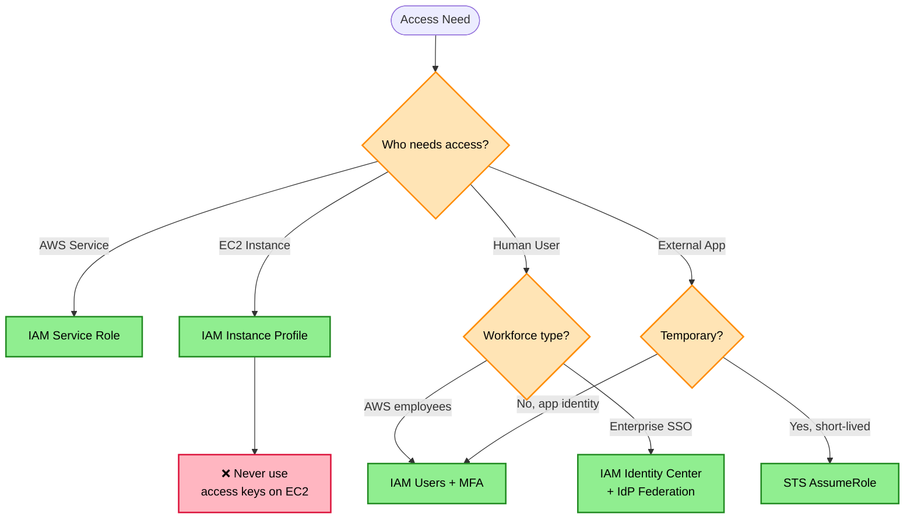
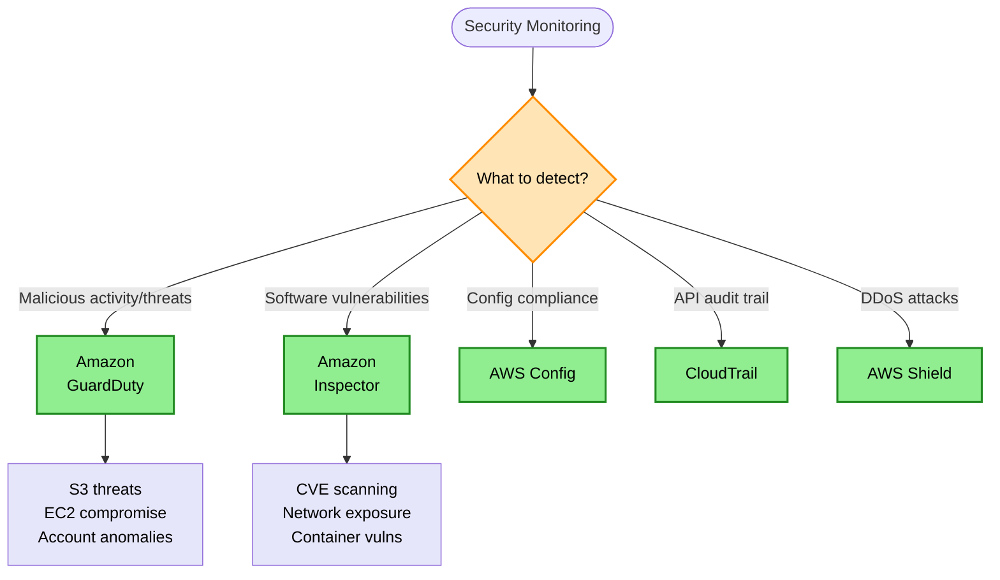
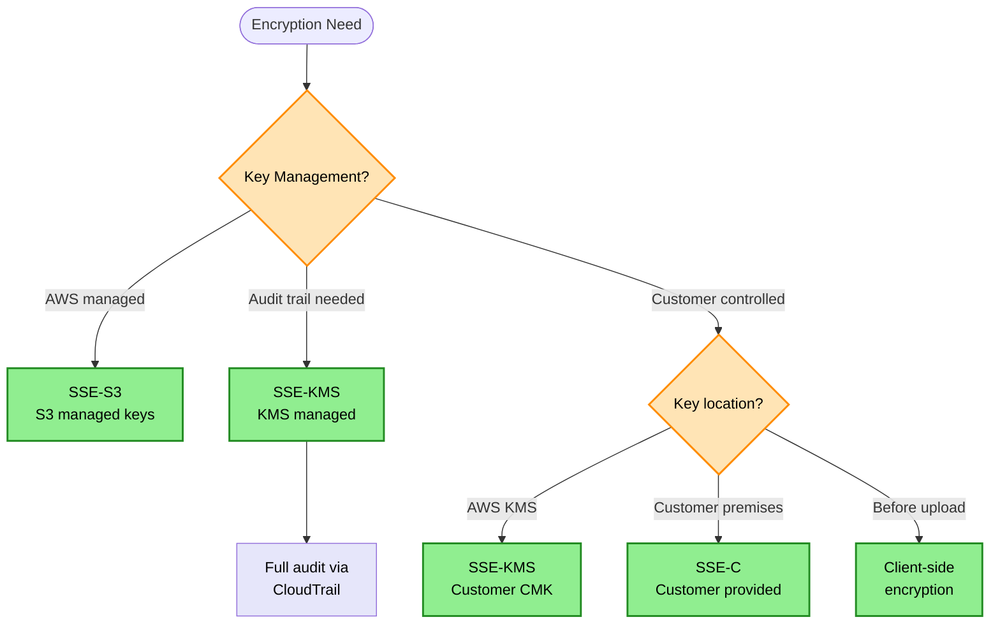
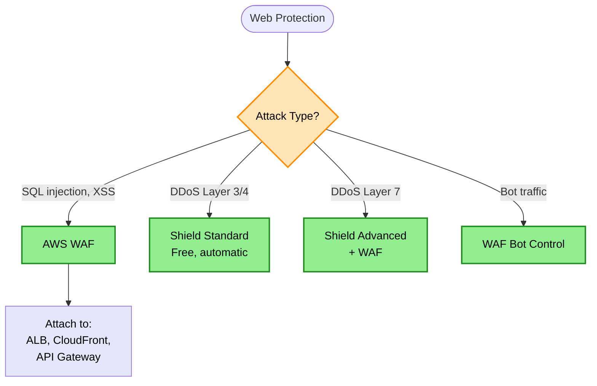
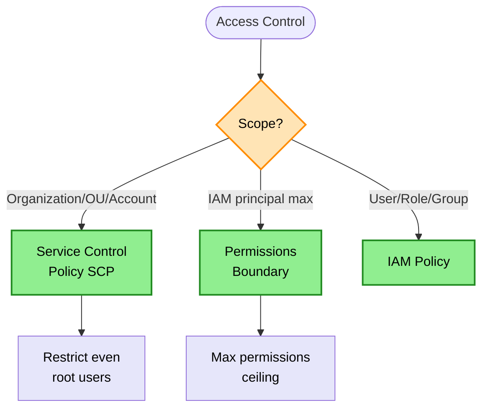

# Security Decision Tree

> **Purpose:** Choose the right AWS security service for identity management, threat detection, compliance, encryption, and access control.

## Identity & Access Decision



## Threat Detection Decision



## Encryption Decision



## Web Application Protection



## Keyword → Service Mapping

| Keywords / Signals | AWS Service | Reasoning |
|--------------------|-------------|-----------|
| temporary credentials | IAM Roles / STS | No long-lived keys |
| EC2 needs AWS access | IAM Instance Profile | Never use access keys |
| multi-account, enterprise SSO | IAM Identity Center | Centralized access |
| threat detection, malicious activity | GuardDuty | ML-based threat detection |
| vulnerability scanning, CVE | Inspector | Software vulnerability detection |
| API audit, who did what | CloudTrail | API logging |
| compliance rules | AWS Config | Configuration compliance |
| DDoS protection | Shield | Layer 3/4/7 protection |
| SQL injection, XSS | WAF | Web app firewall |
| secrets storage | Secrets Manager | Automatic rotation |
| parameters, config | Parameter Store | Simple key-value |
| encryption audit | SSE-KMS | CloudTrail integration |

## Elimination Rules

| Never Choose | When | Because |
|--------------|------|---------|
| Hard-coded credentials | Ever | Security anti-pattern |
| IAM User for EC2 | Instance needs AWS access | Use Instance Profile |
| Root account | Day-to-day operations | MFA + emergency only |
| Inspector | Need threat detection | Inspector scans vulns, not threats |
| GuardDuty | Need vuln scanning | GuardDuty detects threats, not CVEs |
| Shield Standard | Layer 7 DDoS protection | Use Shield Advanced + WAF |
| SSE-S3 | Need audit trail | No CloudTrail logging |

## Security Services Comparison

| Service | Purpose | Scope |
|---------|---------|-------|
| GuardDuty | Threat detection | S3 suspicious access, crypto mining, EC2 compromise |
| Inspector | Vulnerability scanning | EC2, ECR, Lambda CVE detection |
| Config | Resource compliance | Configuration history, compliance rules |
| CloudTrail | API call logging | Who did what, when |
| Security Hub | Centralized findings | Aggregate from all security services |
| Security Lake | Centralized security logs | Multi-account security data lake |

> **Key Rules:**
> - Threat detection → GuardDuty
> - Vulnerability scanning → Inspector
> - Resource configuration compliance → AWS Config
> - API audit → CloudTrail
> - Multi-account security logs → Security Lake

## Security Log Aggregation Options

| Solution | Effort | Features |
|----------|--------|----------|
| Security Lake | Lowest | Auto-collection, OCSF format, built-in |
| Lake Formation + Glue | Medium | Custom ETL, flexible schema |
| Lambda + S3 | Highest | Full custom, maximum control |

> **Rule:** Multi-account security logs + least effort → Amazon Security Lake

## Secrets Management Comparison

| Service | Use Case | Rotation |
|---------|----------|----------|
| Secrets Manager | DB passwords, API keys | Built-in automatic |
| Parameter Store | Config values, simple secrets | Manual |
| KMS | Encryption keys | Automatic (yearly) |

## Organization Guardrails Decision



## Organization Guardrails Comparison

| Guardrail | Scope | Use Case |
|-----------|-------|----------|
| SCP | Organization/OU/Account | Restrict even root users |
| Permissions Boundary | IAM principal | Max permissions ceiling |
| IAM Policy | User/Role/Group | Standard permissions |

> **Rules:**
> - Org-wide restriction → SCP
> - Prevent users escalating permissions → Permissions Boundary
> - SCP = only way to restrict root users in member accounts

## IAM Policy Evaluation Logic

```
1. Explicit Deny (wins everything)
2. Explicit Allow
3. Implicit Deny (default)
```

> **Rule:** Explicit Deny > Explicit Allow > Implicit Deny

## IAM Condition Keys

| Key | Purpose | Example |
|-----|---------|---------|
| aws:SourceIp | Caller's IP address | Restrict API calls by location |
| aws:SourceVpc | Caller's VPC | Internal VPC access only |
| aws:SourceVpce | VPC endpoint used | Specific endpoint required |
| aws:RequestedRegion | Region for resource creation | Restrict deployments to regions |
| aws:PrincipalOrgID | Organization restriction | Cross-account within org |
| aws:MultiFactorAuthPresent | MFA used | Require MFA for sensitive actions |
| s3:x-amz-acl | S3 ACL requirement | Require specific ACL on PUTs |
| ec2:InstanceType | Instance type restriction | Limit to specific types |

> **Rules:**
> - aws:SourceIp = WHERE API call originates (caller's IP)
> - aws:RequestedRegion = WHERE resource is created
> - ec2:Region = EC2-specific region control

## API Gateway Authorization

| Method | Use Case | Token Type |
|--------|----------|------------|
| Resource Policy | IP/VPC restriction | N/A |
| IAM Authorization | AWS credentials | SigV4 |
| Cognito Authorizer | User pools | Cognito tokens |
| Lambda Authorizer | Custom logic | Any |
| JWT Authorizer (HTTP API) | OIDC/JWT tokens | JWT |

> **Rules:**
> - API Gateway IP restriction → Resource Policy (not SGs)
> - JWT/OIDC native validation → HTTP API JWT Authorizer
> - API Gateway has no security groups

## EC2 Credentials - Best Practice

| ✅ Do | ❌ Never |
|-------|---------|
| IAM Role + Instance Profile | Hardcoded credentials |
| | Credentials in config files |
| | Credentials in S3 |
| | Credentials in environment variables |

> **Rule:** EC2 accessing AWS services → IAM Instance Profile. Never store credentials on instances.

## Cross-Account Access Patterns

| Type | Method |
|------|--------|
| Human access | IAM Identity Center |
| Programmatic | IAM Role + AssumeRole |
| Hybrid AD | IAM Identity Center + AD Connector |

> **Rule:** Cross-account programmatic → IAM Role + AssumeRole

## Certificate Management

| Scenario | Solution |
|----------|----------|
| Certificate expiration alerts | AWS Config managed rule + SNS |
| Auto-renewal | ACM-issued certificates (not imported) |
| Imported certificates | Manual renewal required |

> **Rule:** Certificate expiration alerts → AWS Config managed rule + SNS

## Root Account Best Practices

| ✅ Do | ❌ Never |
|-------|---------|
| Strong password | Create access keys |
| MFA enabled | Share credentials |
| | Store credentials anywhere |

> **Rule:** Root: MFA + password only, NO access keys ever

## IAM Best Practices Checklist

| Practice | Implementation |
|----------|----------------|
| ✅ Least privilege | Minimal permissions per role |
| ✅ MFA for humans | Require MFA for console |
| ✅ No root access keys | Delete root access keys |
| ✅ Temporary credentials | Use IAM roles, not users |
| ✅ Permissions boundaries | Limit max permissions |
| ✅ Audit logging | Enable CloudTrail |

## S3 Encryption Comparison

| Method | Key Management | Audit Trail | Cost |
|--------|---------------|-------------|------|
| SSE-S3 | S3 managed | No | Free |
| SSE-KMS | KMS managed | Yes (CloudTrail) | KMS API calls |
| SSE-KMS (CMK) | Customer CMK | Yes | KMS + key cost |
| SSE-C | Customer provided | No | Free |
| Client-side | Customer managed | N/A | Varies |

## KMS Key Types

| Type | Scope | Use Case |
|------|-------|----------|
| Single-Region Keys | One region | Most use cases |
| Multi-Region Keys | Multiple regions | Cross-region replication, DR |

**Multi-Region Keys Benefits:**
- Same key ID across regions
- Simplifies S3 Cross-Region Replication for encrypted objects
- Disaster recovery with encrypted data

> **Rule:** S3 CRR with encryption → SSE-KMS with Multi-Region Keys

## CloudWatch Monitoring Levels

| Level | Interval | Cost |
|-------|----------|------|
| Basic | 5 minutes | Free |
| Detailed | 1 minute | Cost per metric |
| High-Resolution | Up to 1 second | Custom metrics |

**Needs CloudWatch Agent:**
- Memory utilization
- Disk utilization
- Custom metrics

> **Rule:** "Quick + low maintenance + <5 min intervals" → Enable Detailed Monitoring

## Trade-off Matrix

| Aspect | IAM User | IAM Role | Identity Center |
|--------|----------|----------|-----------------|
| Credential Type | Long-lived | Temporary | Federated |
| Use Case | Simple/legacy | Services, EC2 | Enterprise SSO |
| Security | Lower | Higher | Highest |
| Management | Per-account | Per-account | Centralized |

## Real-World Scenarios

### Scenario 1: EC2 Application Needs S3 Access
**Requirement:** App on EC2 must read from S3
**Decision:** IAM Instance Profile with S3 read policy
**Reasoning:** Never store credentials on EC2

### Scenario 2: Detect S3 Data Exfiltration
**Requirement:** Alert on suspicious S3 access patterns
**Decision:** Amazon GuardDuty
**Reasoning:** GuardDuty analyzes CloudTrail + VPC Flow Logs

### Scenario 3: Scan Containers for CVEs
**Requirement:** Check ECR images for vulnerabilities
**Decision:** Amazon Inspector
**Reasoning:** Built-in container image scanning

### Scenario 4: Enterprise Multi-Account SSO
**Requirement:** 500 employees, 20 AWS accounts, Active Directory
**Decision:** IAM Identity Center + AD Connector
**Reasoning:** Centralized SSO, no password sync

### Scenario 5: Prevent Over-Privileged Roles
**Requirement:** Developers can create roles but not admin access
**Decision:** IAM Permissions Boundaries
**Reasoning:** Cap maximum permissions developers can grant

### Scenario 6: Encryption with Audit Trail
**Requirement:** S3 encryption, need to track key usage
**Decision:** SSE-KMS
**Reasoning:** CloudTrail logs every encryption/decryption

### Scenario 7: Block SQL Injection on ALB
**Requirement:** Protect web app from OWASP Top 10
**Decision:** AWS WAF on ALB
**Reasoning:** WAF managed rules for SQLi, XSS

## Common Mistakes

1. **Mistake:** Storing AWS credentials in code/environment
   **Correct approach:** Use IAM roles for services

2. **Mistake:** Using GuardDuty for vulnerability scanning
   **Correct approach:** Use Inspector for CVE detection

3. **Mistake:** Using root account for daily tasks
   **Correct approach:** Create IAM users/roles, use root only for emergencies

4. **Mistake:** Sharing IAM credentials between users
   **Correct approach:** One IAM user per person, use roles for sharing

5. **Mistake:** SSE-S3 when audit trail needed
   **Correct approach:** Use SSE-KMS for CloudTrail integration

## Network Security Layers

| Layer | Service | Controls |
|-------|---------|----------|
| Edge | Shield, WAF, CloudFront | DDoS, web attacks |
| VPC | NACLs | Subnet-level, stateless |
| Instance | Security Groups | Instance-level, stateful |
| Application | IAM, Cognito | Identity, authorization |
| Data | KMS, Secrets Manager | Encryption, secrets |

## Related Decisions

- [Networking Decisions](./networking-decisions.md) - WAF placement
- [Database Decisions](./database-decisions.md) - Encryption at rest
- [Compute Decisions](./compute-decisions.md) - Instance profiles

---

## Quick Reference

1. **Temporary credentials** → IAM Roles (always)
2. **EC2 AWS access** → Instance Profile (never keys)
3. **Threat detection** → GuardDuty
4. **Vulnerability scanning** → Inspector
5. **Audit trail for encryption** → SSE-KMS
6. **SQL injection/XSS** → WAF
7. **DDoS** → Shield (Standard free, Advanced paid)
8. **Root account** → MFA + strong password only
9. **Prevent excessive permissions** → Permissions Boundaries
10. **Org-wide restriction** → SCP (even restricts root)
11. **API Gateway IP restriction** → Resource Policy (not SGs)
12. **Cross-account programmatic** → IAM Role + AssumeRole
13. **Certificate expiration alerts** → AWS Config rule + SNS
14. **Multi-account security logs** → Security Lake
15. **Explicit Deny** → Always wins in IAM evaluation
