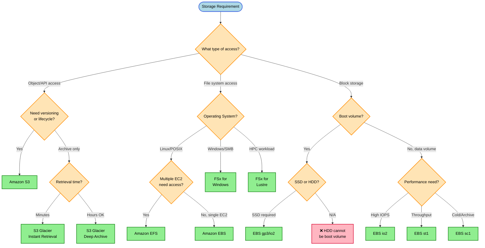
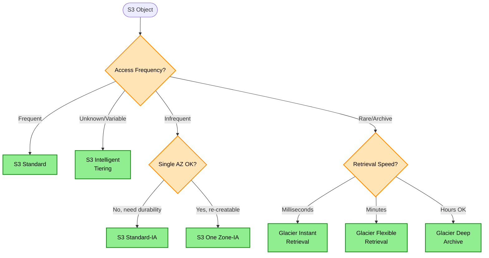
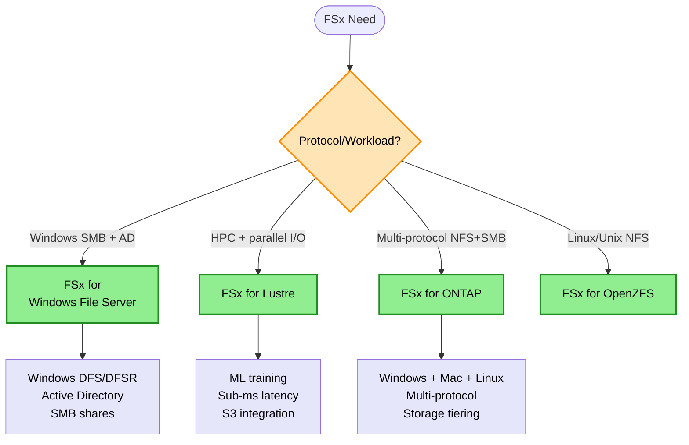

# Storage Decision Tree

> **Purpose:** Choose the right AWS storage service based on access patterns, sharing requirements, durability needs, and cost constraints.

## Decision Flowchart



## S3 Storage Class Decision



## Keyword → Service Mapping

| Keywords / Signals | AWS Service | Reasoning |
|--------------------|-------------|-----------|
| object storage, durability, 11 9s | S3 | Highest durability (99.999999999%) |
| multiple EC2 need access, shared | EFS | Only shared file system for Linux |
| single EC2, block, database | EBS | Attached to single instance |
| Windows, SMB, DFS, Active Directory | FSx for Windows | Native Windows file server |
| HPC, parallel I/O, machine learning | FSx for Lustre | Sub-millisecond latencies |
| archive, compliance, years | S3 Glacier | Lowest cost for long-term |
| hot then cold, variable access | S3 Intelligent-Tiering | Auto-tiering |

## FSx Family Decision



## FSx Family Comparison

| FSx Type | Use Case | Protocol | Best For |
|----------|----------|----------|----------|
| FSx for Windows | Windows apps, AD, DFS | SMB | Windows file shares |
| FSx for Lustre | HPC, ML, parallel processing | NFS/Lustre | Sub-millisecond latency |
| FSx for ONTAP | Multi-protocol, tiering | NFS + SMB | Windows + Mac + Linux (all three) |
| FSx for OpenZFS | Linux/Unix workloads | NFS | ZFS snapshots, clones |

## Elimination Rules

| Never Choose | When | Because |
|--------------|------|---------|
| EBS | Multiple EC2 need shared access | EBS attaches to single instance only |
| sc1/st1 (HDD) | Boot volume required | Only SSD can be boot volume |
| S3 Glacier | Immediate retrieval needed | Retrieval takes minutes to hours |
| One Zone-IA | Data cannot be recreated | Single AZ = lower durability |
| EFS | Windows workload | EFS is POSIX/Linux only |
| FSx Lustre | Windows file shares | Use FSx for Windows instead |
| FSx for Windows | Multi-protocol NFS+SMB needed | Use FSx for ONTAP |
| EFS | HPC parallel I/O | Use FSx for Lustre |

## Cost Comparison (per GB/month, us-east-1)

| Service | Storage Cost | Best For |
|---------|--------------|----------|
| S3 Standard | $0.023 | Frequently accessed objects |
| S3 Standard-IA | $0.0125 | Infrequent, instant retrieval |
| S3 Glacier Deep Archive | $0.00099 | Long-term archive |
| EFS Standard | $0.30 | Shared file access |
| EBS gp3 | $0.08 | General purpose block |
| EBS sc1 | $0.015 | Cold HDD data |

## Cost Mental Model

```
S3 (pay per GB stored) < EFS (pay per GB stored) < EBS (pay per GB PROVISIONED)
```

> **Key Insight:** EBS charges for provisioned capacity. 100GB provisioned with 1GB used = pay for 100GB.

## Trade-off Matrix

| Aspect | S3 | EFS | EBS | FSx Lustre |
|--------|-----|-----|-----|------------|
| Durability | 11 9s | 3 AZ | Single AZ* | 3 AZ |
| Latency | ~100ms | ~ms | <1ms | <1ms |
| Throughput | Very High | High | High | Very High |
| Shared Access | Yes (API) | Yes (mount) | No | Yes |
| Cost | Lowest | Medium | Medium | High |
| Ops Overhead | None | Low | Medium | Low |

*EBS can be Multi-AZ with io2 Block Express

## Real-World Scenarios

### Scenario 1: Web Application Static Assets
**Requirement:** Store images/CSS/JS, serve globally, cost-effective
**Decision:** S3 + CloudFront
**Reasoning:** S3 for durability, CloudFront for edge caching

### Scenario 2: Shared Configuration Files Across Auto Scaling Group
**Requirement:** Multiple EC2 instances need same config files
**Decision:** Amazon EFS
**Reasoning:** Only option for shared Linux file system

### Scenario 3: Database Storage
**Requirement:** MySQL RDS needs high IOPS storage
**Decision:** EBS io2 or gp3
**Reasoning:** Block storage required, provisioned IOPS for DB

### Scenario 4: Machine Learning Training Data
**Requirement:** Process TBs of data with high throughput
**Decision:** FSx for Lustre linked to S3
**Reasoning:** HPC-grade throughput, S3 integration for data lake

### Scenario 5: 7-Year Compliance Archive
**Requirement:** Store audit logs, accessed once per year
**Decision:** S3 Glacier Deep Archive
**Reasoning:** Lowest cost, hours retrieval acceptable

## Common Mistakes

1. **Mistake:** Using EBS for shared storage across instances
   **Correct approach:** Use EFS for shared file access

2. **Mistake:** Choosing Glacier when immediate access needed
   **Correct approach:** Use S3 Standard-IA for instant retrieval

3. **Mistake:** Using S3 Standard for archival data
   **Correct approach:** Use lifecycle policies to transition to Glacier

4. **Mistake:** Provisioning large EBS volumes "just in case"
   **Correct approach:** Start small, EBS volumes can be resized

## S3 Protection & Security

| Feature | Purpose | Use Case |
|---------|---------|----------|
| Versioning | Recover deleted/overwritten | Accidental delete protection |
| MFA Delete | Prevent permanent deletes | Compliance, critical data |
| Object Lock | Compliance/legal hold | WORM compliance |
| Bucket Owner Enforced | Cross-account ownership | Ensure bucket owner owns all objects |

## S3 Object Lock Modes

| Mode | Can Override? | Use Case |
|------|--------------|----------|
| Compliance | No (even root) | Regulatory requirements, strictest |
| Governance | Yes (with permission) | Internal policies, some flexibility |

> **Rule:** WORM + immediate access → S3 Object Lock. Compliance mode = nobody can delete until retention expires.

## Glacier Vault Lock

| Feature | Description |
|---------|-------------|
| Immutable | Once locked, policy cannot be changed |
| WORM | Write Once Read Many |
| Compliance | For SEC, HIPAA, regulatory requirements |

> **Rule:** WORM + archive/low-cost → Glacier Vault Lock (not Object Lock)

## Storage Gateway Volume Types

| Type | Data Location | Use Case |
|------|--------------|----------|
| Stored Volumes | Full data on-prem, backup to S3 | Quick local access, no retrieval fees |
| Cached Volumes | Hot data on-prem, cold in S3 | Extend capacity, cache frequently accessed |

> **Rule:** "No retrieval fees" + "quick local access" → Stored Volumes. "Extend capacity" → Cached Volumes.

## EFS Throughput Modes

| Mode | Behavior | Best For |
|------|----------|----------|
| Bursting | Credits-based, accumulate during low usage | Sporadic, bursty workloads |
| Provisioned | Fixed throughput (configured) | Consistent high throughput |
| Elastic | Auto-scales, pay per use | Variable workloads |

## EFS Storage Classes

| Class | Cost | Use Case |
|-------|------|----------|
| Standard | Higher | Frequently accessed |
| Infrequent Access (IA) | Lower (+ retrieval fee) | Rarely accessed |

> **Rule:** "Sporadic bursts" + "low average" + "cost optimization" → Burst mode + IA storage class

## EBS Fast Snapshot Restore

| Without FSR | With FSR |
|-------------|----------|
| Lazy loading from S3 | Pre-warmed volumes |
| Variable initial performance | Full performance immediately |
| Free | Cost per AZ per snapshot |

> **Rule:** "High consistent I/O immediately" from snapshot → Enable Fast Snapshot Restore

## S3 Global Performance

| Direction | Solution |
|-----------|----------|
| Downloads from global locations | CloudFront (edge caching) |
| Uploads from global locations | S3 Transfer Acceleration |

> **Rule:** Global S3 access = CloudFront (downloads) + S3TA (uploads). Both use edge network.

## S3 Encryption Options

| Option | Key Management | Audit Trail | Cost |
|--------|---------------|-------------|------|
| SSE-S3 | AWS managed | ❌ No | Free |
| SSE-KMS | AWS KMS | ✅ Yes (CloudTrail) | KMS API calls |
| SSE-KMS (CMK) | Customer CMK | ✅ Yes | KMS + key cost |
| SSE-C | Customer provided | ❌ No | Free |
| Client-Side | Customer managed | ❌ No | Varies |

> **Rule:** Audit trail needed → SSE-KMS | Keys on-premises → Client-Side Encryption

## S3 IAM Policy ARN Patterns

| Action Type | ARN Pattern | Example Actions |
|-------------|-------------|-----------------|
| Bucket-level | `arn:aws:s3:::bucket-name` | ListBucket, GetBucketLocation |
| Object-level | `arn:aws:s3:::bucket-name/*` | GetObject, PutObject, DeleteObject |

> **Critical:** Object operations MUST have `/*` suffix. Bucket operations MUST NOT have `/*`.

## S3 Performance

| Scenario | Solution |
|----------|----------|
| 5000+ PUT/sec throttling | Spread keys across prefixes |
| High egress costs | CloudFront in front of S3 |
| Large file uploads | Multipart upload |

> S3 scales to 3,500 PUT + 5,500 GET per second per prefix.

## Data Transfer to AWS

| Method | Use Case | Targets |
|--------|----------|---------|
| DataSync | Online migration, scheduled sync | S3, EFS, FSx |
| Transfer Family | SFTP/FTP for legacy vendors | S3 only |
| Snowball | Offline bulk (10-80 TB) | S3 only |
| Snowmobile | Data center migration (PB+) | S3 only |
| Storage Gateway | Hybrid ongoing access | S3 backend |

> **Rules:**
> - Online migration to S3/EFS/FSx → DataSync
> - SFTP for legacy vendors → Transfer Family
> - Snowball cannot target Glacier directly → S3 + lifecycle
> - HPC + Snowball → S3 first, then FSx Lustre linked to S3

## EBS Volume Types

| Type | Max IOPS | Throughput | Boot Volume | Use Case |
|------|----------|------------|-------------|----------|
| gp3 | 16,000 | 1,000 MB/s | ✅ Yes | General purpose, boot |
| gp2 | 16,000 | 250 MB/s | ✅ Yes | General purpose (older) |
| io1/io2 | 64,000 | 1,000 MB/s | ✅ Yes | High IOPS, databases |
| st1 | 500 | 500 MB/s | ❌ No | Throughput, big data |
| sc1 | 250 | 250 MB/s | ❌ No | Cold data, infrequent |

> **Critical:** Boot volumes → SSD only (gp2/gp3/io1/io2). HDD (st1/sc1) cannot be boot volumes.

## S3 Lifecycle Transition Rules

Valid transitions (can only move to **colder** tiers):

```
Standard → Standard-IA → Intelligent-Tiering → Glacier IR → Glacier FR → Deep Archive
```

**Invalid transitions:**
- ❌ Standard-IA → Standard (cannot go warmer)
- ❌ Any tier → Intelligent-Tiering (must start there)

## Instance Store vs EBS

| Aspect | Instance Store | EBS |
|--------|---------------|-----|
| Persistence | Ephemeral (lost on stop/terminate) | Persistent |
| IOPS | Very high (NVMe) | Up to 64,000 (io2) |
| Cost | Included with instance | Per GB provisioned |
| Use Case | Temp data, caches, replicated data | Databases, boot volumes |

> **Rule:** Highest IOPS + disposable nodes + replicated data → Instance Store

## S3 Cross-Account Object Ownership

| Setting | Behavior |
|---------|----------|
| Bucket owner enforced (recommended) | Bucket owner owns all objects |
| Object writer (legacy) | Uploader owns objects |

**Fix Options:**
1. Enable "Bucket owner enforced" Object Ownership
2. Require `bucket-owner-full-control` ACL on PUTs
3. Bucket policy to deny PUTs without proper ACL

> **Rule:** Cross-account S3 writes → uploader owns by default. Enable "Bucket owner enforced" to fix.

## Related Decisions

- [Caching Decisions](./caching-decisions.md) - When to cache S3 content
- [Database Decisions](./database-decisions.md) - Storage for databases
- [Migration Decisions](./migration-decisions.md) - On-prem to cloud storage

---

## Quick Reference

1. **Multiple EC2 need access** → EFS (not EBS)
2. **Highest durability** → S3 (11 9s)
3. **Boot volume** → Only SSD EBS (gp2/gp3/io1/io2)
4. **Windows/SMB** → FSx for Windows
5. **HPC** → FSx for Lustre
6. **Provisioned but unused** → EBS is most expensive
7. **Windows + Mac + Linux (all three)** → FSx for ONTAP
8. **Encryption audit trail** → SSE-KMS
9. **Keys must stay on-premises** → Client-Side Encryption
10. **S3 object operations** → ARN must have `/*` suffix
11. **Online migration to S3/EFS/FSx** → DataSync
12. **>16,000 IOPS** → Provisioned IOPS (io1/io2)
